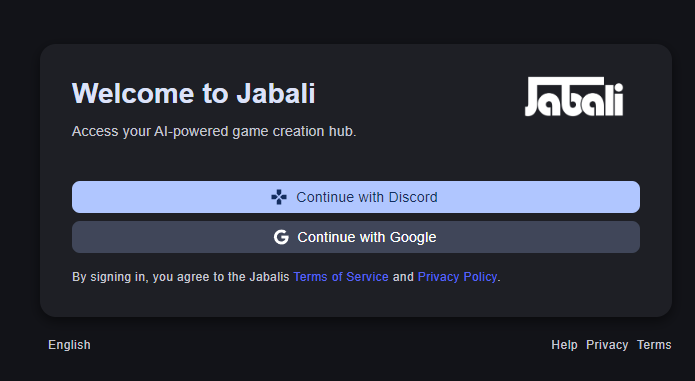
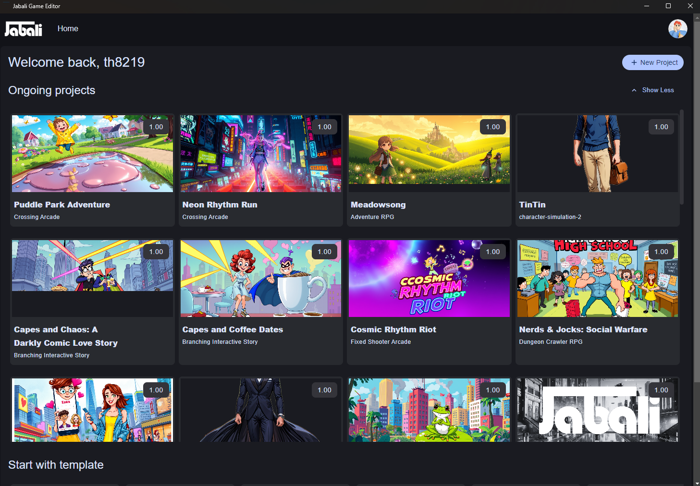
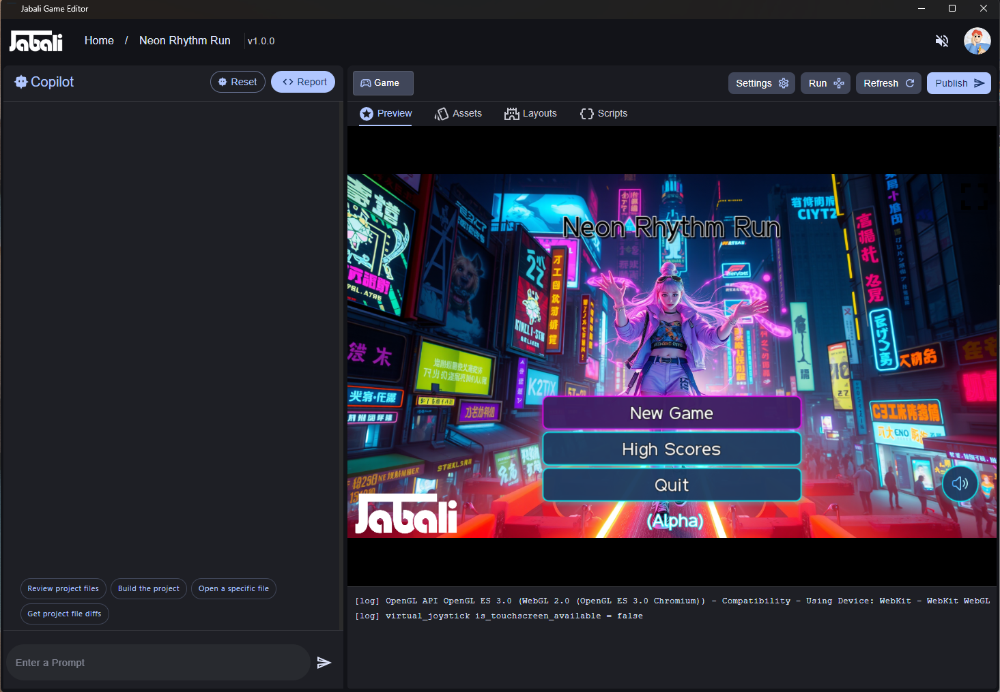

# 🛠 Installing the Jabali Desktop Editor

## Windows Installation
1. Download the `.exe` installer from [The jabali Website](https://play.production.jabali.ai/setup/)
2. Run the installer and follow the on-screen steps
3. Launch the Jabali Editor
4. If you see a pop-up like the one below, first click "More info", then click "Run anyway"

## Mac Installation
1. Download the `.dmg` file from [The jabali Website](https://play.production.jabali.ai/setup/)
2. Drag the app to `Applications`
3. If you see a security warning, right-click the app and choose **Open**
4. Run the command in Terminal app _xattr -c /Applications/Jabali\ Game\ Editor.app/_

## System Requirements
- **Windows**: 10 or later
- **Mac**: macOS 12 or later
- **RAM**: 4GB minimum (8GB recommended)
- **Disk**: 500MB free space

Need help? See the [FAQ](editor-faq.md)

# 🔐 Signing In 

> ❗ You must be a Jabali Discord or Google user to access your projects.

## How to Sign In
1. Launch the Jabali Desktop Editor
2. Click **Continue with Discord** to use Discord to signin
3. Click **Continue with Google** to use your Google account
3. A browser window will open for authentication
4. Approve the login request
5. The Editor will auto-sync your games

If sign-in fails, try restarting the app or logging out from Discord in your browser.

# 📁 Loading a Game Project

Once signed in, Jabali syncs your games created in Discord or Web.

## Load a Game
1. From the start screen, click on any game in your library 
2. Your game will open in the editor

Next: [Overview of Jabali Editor UI](editor-ui-overview.md)