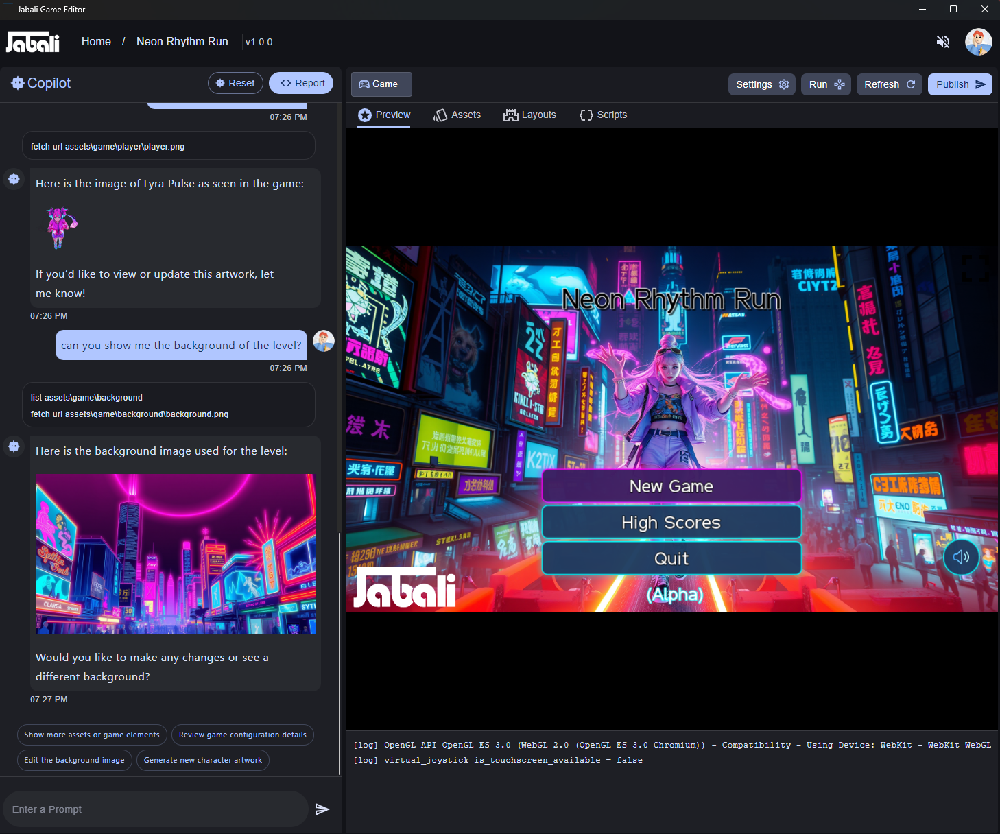
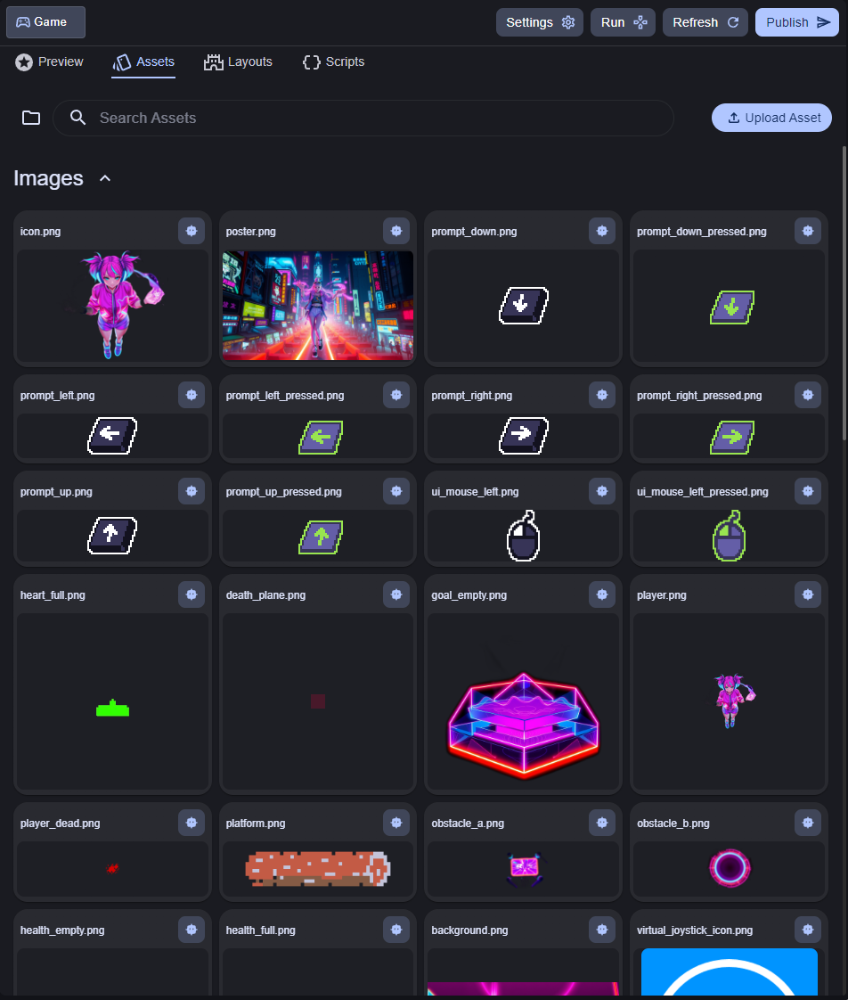
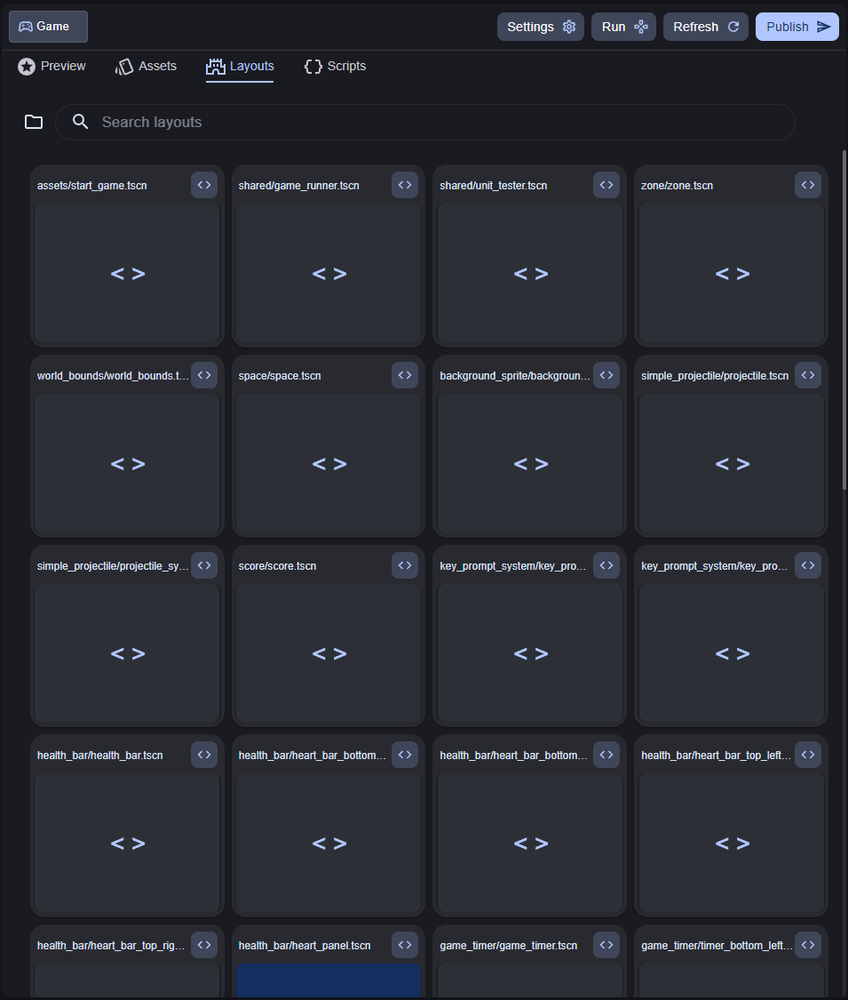
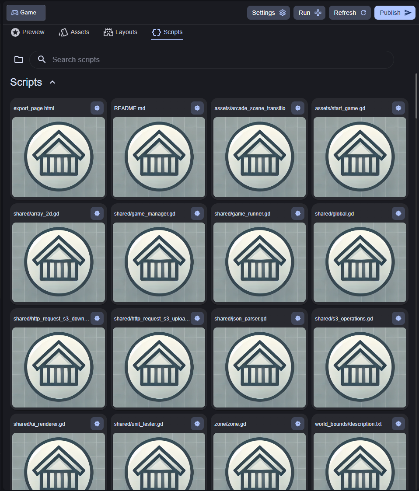

# 🧭 Jabali Editor UI Overview

The Jabali Desktop Editor features a clean, split-pane interface designed for powerful game creation with minimal complexity.

Whether you’re refining assets, editing gameplay logic, or collaborating with the AI Co-Pilot, the layout is built to keep your creative flow uninterrupted.

---

## 🖥️ Interface Structure

The Editor interface has **two main panes**:

| Pane             | Description                                                                 |
|------------------|-----------------------------------------------------------------------------|
| **Left Pane – Co-Pilot** | Your AI assistant for prompts, questions, edits, and creative suggestions. |
| **Right Pane – Game Editor** | The main editing area where you view, modify, and manage your project.      |

---

## 🤖 Co-Pilot Panel (Left Pane)

The Co-Pilot lets you interact with your game using natural language.

### What you can do:
- Ask questions about assets, levels, or logic
- Preview and edit artwork, scenes, and scripts
- Generate or regenerate characters, dialogue, or layout
- Make direct edits using suggestions or follow-up commands

You can click on quick actions such as:
- **Edit background image**
- **Generate new character artwork**
- **Review game configuration**

Learn more in [Using Co-Pilot](editor-copilot.md)

---

## 🎮 Game Editing View (Right Pane)

This is your central workspace. Across the top are four powerful tabs:

### 1. **Preview**
View a live preview of your game as it currently exists, including updated visuals, scripts, and interactions.

- Great for reviewing layout and flow.
- Click **Run** to simulate gameplay on desktop in a separate window or **Refresh** after changes.

---

### 2. **Assets**

Browse and manage all game assets:
- Character sprites
- Backgrounds
- Sound files
- UI elements

From this tab you can:
- Upload new assets
- Regenerate visuals via AI
- Replace or rename files
- Review asset metadata and linked scenes

---

### 3. **Layouts**

View and edit all game layout files, structured as Godot `.tscn` scenes.

This tab is ideal for:
- Arranging level geometry
- Positioning characters and objects
- Editing node trees and interaction zones

Each layout corresponds to a scene in the game’s story or level structure.

---

### 4. **Scripts**

Explore and modify the game’s logic in **GDScript**.

You can:
- Edit game logic for interactions, NPC behavior, scoring, triggers, etc.
- Debug issues using Co-Pilot or in the terminal log view
- Save and test changes in real time

Scripts are organized by scene or asset type.

---

## 📤 Publishing Your Game

When you're ready, click **Publish** in the top-right corner to export your changes.

This will:
- Sync your edits to Jabali’s cloud
- Update the hosted version of your game
- Generate a new playable link (or replace an existing one)

---

## 🛠 Additional UI Controls

| Control | Description |
|--------|-------------|
| **Run**     | Playtest your current scene or game |
| **Settings** | Change project preferences, resolution, or export settings |
| **Refresh** | Reload the preview with the latest changes |
| **Report** | Flag issues or provide feedback on Co-Pilot suggestions |

---

Ready to dive in?  
Explore your game like never before with [Jabali’s powerful, prompt-driven editor](editor-copilot.md).
