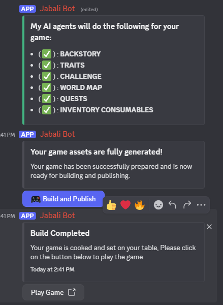
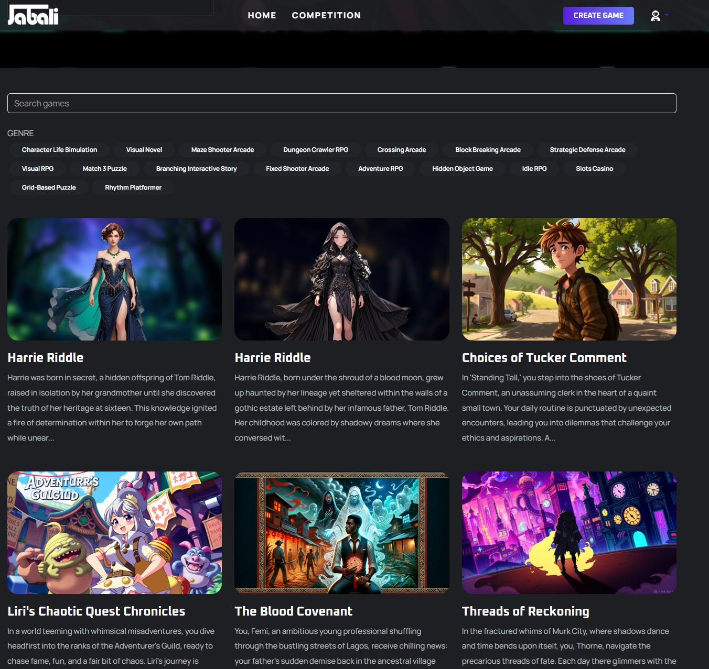

# Building your Game 

Once your game is generated, you will be presented with the **Build and Publish** button. You can use this to finalize your game assets and generate a binary build of the game. Building and publishing your game can take some time. 

# Re-Building your Game
Any time you make a change to the game, the game will need to be re-built. You could either click the **Build and Publish** button again. 

# Playing your Game 
Once the game is built, you can play the game on a desktop or mobile browser by clicking on **Play Game**. For mobile browsers, Safari on iOS and Chrome on Android is currently supported. 

Your game is also playable through the [Jabali website](https://play.production.jabali.ai) and is available on your profile page. 

Next: [Prompt Editing](prompt-editing.md)