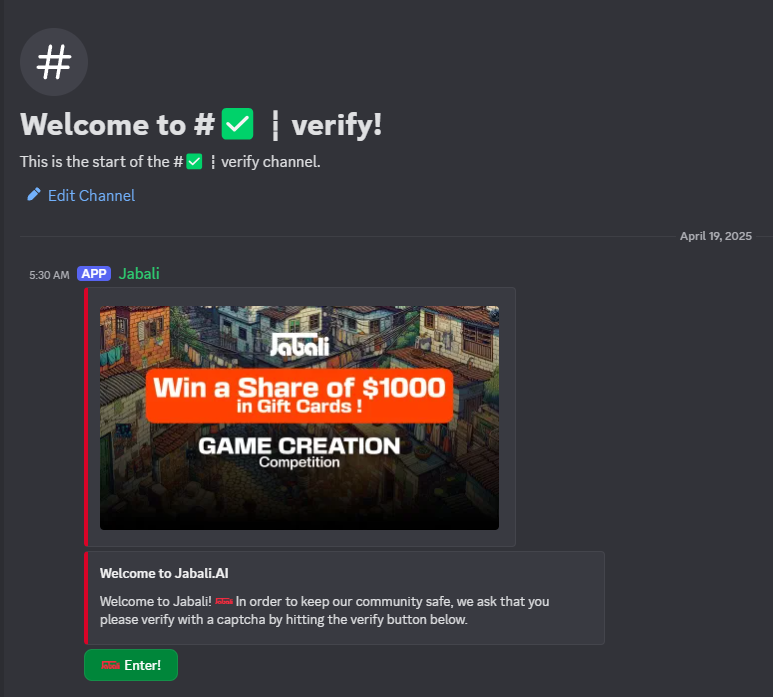
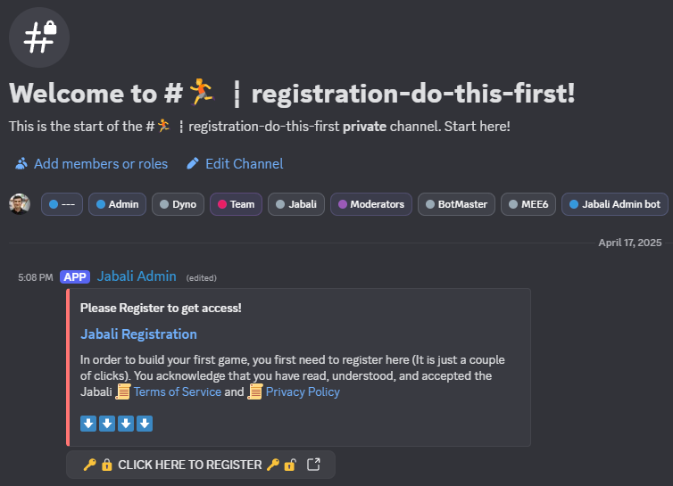

# 🧵 Get Started with Jabali on Discord

Jabali lets you create games directly inside Discord using simple slash commands — no installations, no coding, just you and your imagination.
Whether you're a beginner or a pro, Jabali on Discord is the fastest way to start building AI-generated 2D narrative games.

---

## ✅ Step 1: Join the Jabali Discord Server

To begin, you’ll need to join the Discord server:

👉 [Click here to join](https://discord.gg/jabali)

---

## ✍️ Step 2: Get Verified

Once you've joined the Jabali server head over and get your self [verified](https://discord.com/channels/1203127836844494850/1343882788751015988).

---

## Step 3: Complete Registration 
Go to the Registration channel and complete Registration by clikcing the 'CLICK HERE TO REGISTER' link

Next: [Creating your first game on Discord](create-discord.md)