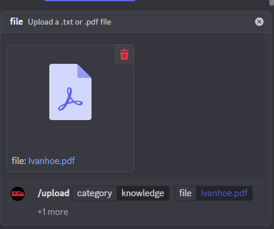
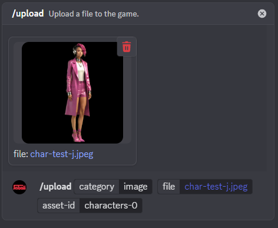

# 📤 Uploading Custom Content via Discord

Jabali lets you upload your own content to enhance game generation — whether it’s a **knowledge file** that enriches the AI’s storytelling, or **branded assets** like custom images and sounds for your game.

All uploads are handled via the `/upload` command in Discord.

---

## 🔍 Supported Upload Types

| Type               | Description                                                   |
|--------------------|---------------------------------------------------------------|
| **Knowledge File** | Text documents used as a knowledge base for AI generation     |
| **Branded Asset**  | Custom images or sound files tied to specific in-game assets  |

---

## 🧠 Uploading a Knowledge File

You can upload background lore, dialogue scripts, worldbuilding documents, or any other reference material that should influence how Jabali generates game content.

### 📁 Supported File Types
- `.pdf`, `.txt`, `.doc` or `.docx`

### 📏 Limits
- Max file size: **5MB**
- Max content length: **1000 lines**

> ⚠️ Larger files will be rejected. 

### 🧵 How to Upload

Use the /upload command in #builder-playground 

## 🎨 Uploading Branded Assets (Images or Audio)

You can upload custom visuals and sounds to override or enrich asset generation — perfect for customer-specific branding, character portraits, soundtracks, and more.

### 🎧 Supported File Types
- Images: .png, .jpg, .jpeg, .gif
- Audio: .mp3, .wav

### How to Upload 

# 🧠 Tips & Suggestions
- Keep knowledge files tightly scoped. Focus on content that's relevant to your current game (e.g., don’t upload a 100-page novel).
- Organize your branded assets with consistent IDs for easier referencing.
- You can re-upload to the same asset-id to update the content.