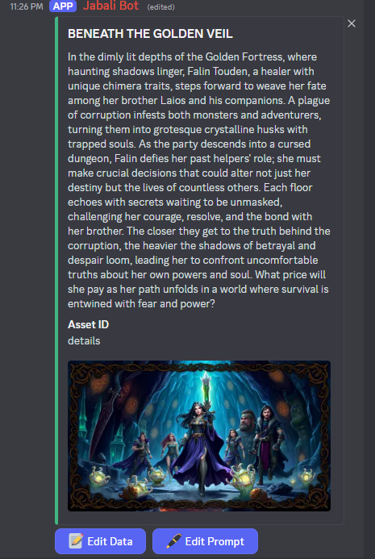
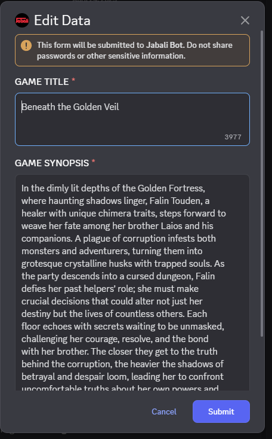

# 📝 Editing Game Content in Discord

After generating a game with Jabali, you can **fine-tune every detail directly within Discord**. Whether you're refining the game's tone or rewriting a character's quirks, editing is fast, conversational, and fun.

This guide walks you through editing different parts of your game using Jabali’s built-in commands and reply-based editing system.

---

## ✨ What You Can Edit

Jabali supports direct text editing of three key areas:

1. **🎮 Core Game Details**
2. **🗺️ Level Details**
3. **🧍 Character Profiles**

You can update these using slash commands or by replying to specific bot messages in the channel.

---

## 🎮 1. Core Game Details

These settings affect the overall tone and feel of your entire game. Edit them to shape your game’s identity.

| Field           | Description                                                   |
|----------------|---------------------------------------------------------------|
| **Visual Style**  | The look and feel of your game (e.g., pixel art, watercolor, 3D flat) |
| **Writing Style** | Narrative tone and dialogue style (e.g., comedic, noir, poetic) |
| **Setting**        | The world in which your game takes place (e.g., sci-fi colony, haunted forest) |
| **Theme**          | The underlying message or emotional tone (e.g., redemption, survival, coming of age) |

### ✏️ How to Edit

During the game generation process look for the **EDIT DATA** button below each generated piece of content. Clicking it will bring up a dialog for you to directly edit the content. 

## Best Practices

- Keep styles consistent: If you're writing in whimsical tone, apply it across characters and levels.
- Short is sweet: Stick to a few sentences for most fields to keep gameplay snappy.
- Be descriptive, not vague: Instead of "cool character", try "a wandering bard with neon tattoos and a cyber-harp."
- Test your edits to ensure they are being carried over to other parts of the game. 

Next: [Uploading Content](upload-content.md)