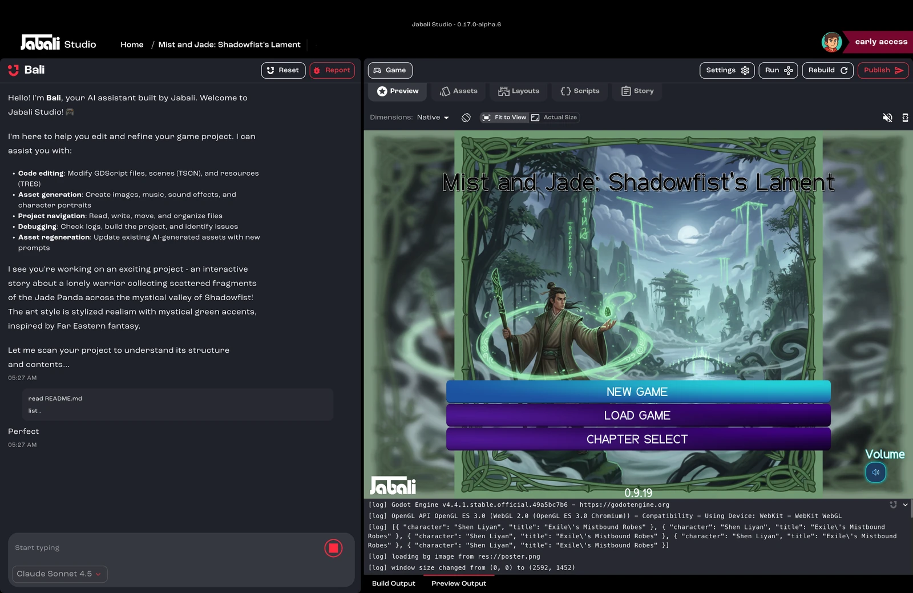

Bali is the AI assistant built into Jabali Studio. It helps you understand, edit and expand your game using natural language. Whether you're tweaking gameplay, fixing logic, editing character bios or exploring what's in your game, you do it all by chatting with Bali.

## What can Bali do?

You can use Bali to:

- **Answer questions** about your game's characters, levels, logic or assets
- **Edit content** such as scene descriptions, story flow, dialogue and character traits
- **Regenerate assets** from updated prompts
- **Debug** scenes or test branching logic
- **Explain code** that controls game behavior, such as roguelike modifiers
- **Suggest improvements** to writing, pacing or structure

## How to use Bali

1. Launch Jabali Studio.
2. [Open a project](/docs/studio/open-a-project/).
3. Find Bali's chat panel on the left side of the Studio.
4. Type your prompts and questions in the chat box.

## Example prompts

| Goal                  | What to ask                                                          |
| --------------------- | -------------------------------------------------------------------- |
| Understand game state | "What are the main story branches in this game?"                     |
| Modify content        | "Change the scene where the player meets the ghost to make it funnier." |
| Improve dialogue      | "Rewrite this dialogue to sound more sarcastic."                     |
| Describe assets       | "What visual assets are used in Level 3?"                            |
| Regenerate a scene    | "Regenerate the dream sequence scene in a noir style."               |
| Debug                 | "Why does Scene 2 not link to the ending?"                           |
| Code help             | "What does this modifier script do in the combat scene?"             |

## Advanced tips

- Bali has full access to the project you have open.
- Use specific scene or character names to target your edits.
- Ask Bali to compare or summarize content, for example *"Summarize all endings."*
- You can preview Bali's changes before committing them.

## Limitations

- Bali works best on one project at a time.
- Bali can't see drafts that exist only on Jabali Web. Open them in Studio first.
- Regenerating assets can take longer than text edits.

## Use cases

- Polish your narrative with fewer clicks
- Rapidly iterate on character backstories
- Use AI as your writing collaborator, code reviewer or test assistant
- Make bulk edits to scenes and branches in plain language

Let Bali handle the heavy lifting while you focus on creativity.

## Related pages

- [Bali best practices](/docs/studio/bali-best-practices/)
- [Jabali Studio FAQ](/docs/studio/faq/)
