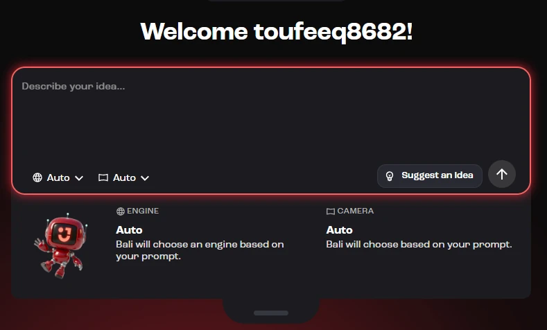
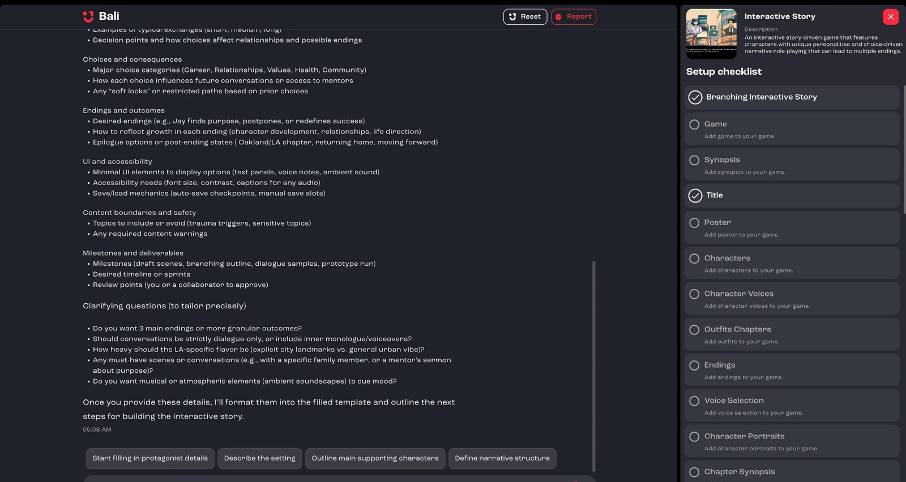
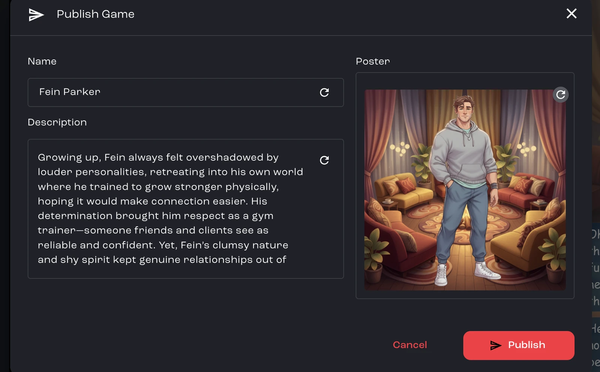
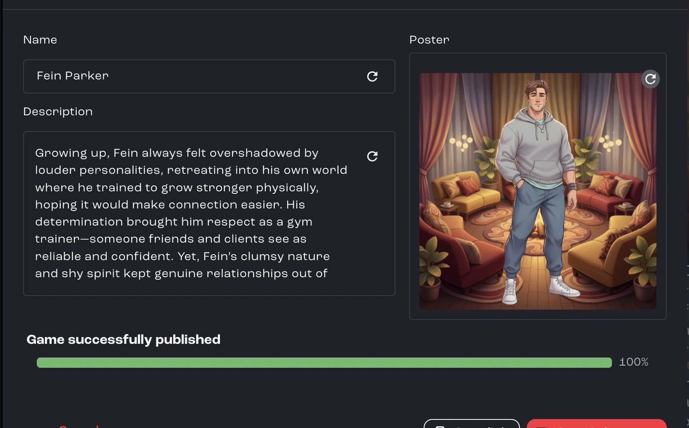

This guide walks you through creating a new game directly inside Jabali Studio, from your first prompt to a published, playable game.

## Ways to start a new project

After you [sign in](/docs/studio/sign-in/), the Studio home screen gives you several ways to start:

| Option                                  | Best for                                                                   |
| --------------------------------------- | -------------------------------------------------------------------------- |
| **Describe your idea**                  | Any game. Write a prompt and Bali builds a first playable version.         |
| **Add design files** to your prompt     | Games you've already planned in documents, sketches or reference images    |
| **Suggest an Idea**                     | Getting a starting prompt when you don't have one yet                      |
| **Templates**                           | Fast game creation from a ready-made genre template                        |

Jabali Studio can also open games you created on Jabali Web or FriendJam, but it is a full game creation environment in its own right. See [Open and manage projects](/docs/studio/open-a-project/).

Under the prompt box, you can choose the **Engine** (Godot or Web, with starters like Phaser and Three.js) and the **Camera** (2D or 3D), or leave both on **Let Bali Decide** and let Bali pick the best option for your prompt. [Engines and web projects](/docs/studio/engines/) explains the options.

### Add design files

Already have a game design document, concept art or a spreadsheet of items? Click **Add design files** to attach them to your prompt. Bali uses them as source material for the game. You can attach Markdown, text, JSON, YAML, CSV, XML, PDF, images, audio, video, 3D models and archives such as ZIP. If you attach files without writing a prompt, Bali creates a game based on the files alone. See [Attachments](/docs/studio/attachments/) for limits.

### Start from a template

Click **Templates** in the sidebar to browse ready-made Godot games, such as Interactive Story, Character Simulation, 3D Racer, Dungeon Crawler RPG, Match 3, Rhythm Platformer and Trivia Game. Click **Use Template** on the one you want.

Studio shows a **Setup checklist** for the template. Fill in what you can, or click **Finish with AI** to let Bali complete the rest. Generating the project files can take a few minutes, and it continues in the background if you go back to the home screen.

**Watch:** [Starter templates and changing a template game](https://youtu.be/aZgecdsUDMY?t=33) (1:03, from the workshop *Jabali Workshop, 6 March 2026 (part 1)*)

<iframe src="https://www.youtube-nocookie.com/embed/aZgecdsUDMY?start=33&amp;end=96" title="Video: Starter templates and changing a template game" loading="lazy" allow="accelerometer; clipboard-write; encrypted-media; gyroscope; picture-in-picture; web-share" referrerpolicy="strict-origin-when-cross-origin" allowfullscreen></iframe>

## Step 1: Enter your prompt

Describe the core idea of your game in one or two sentences. Cover the setting, tone, main character(s) and the player's objective. Not sure where to start? Click **Suggest an Idea**.

**Good prompt**

> Reflections: Navigate the life of Jay, a 22-year-old graduate from the University of California, Los Angeles, as he attempts to discover his life's purpose through a series of conversations with his family, friends and mentors.

**Bad prompt: too vague**

> A game about a recent graduate.

**Bad prompt: too long-winded**

> Step into the multilayered consciousness of Jay, a 22-year-old recently unshackled from the institutional rhythms of the University of California, Los Angeles, who now finds himself suspended in a liminal space between youthful idealism and the encroaching obligations of adult reality, straddling an internal tug-of-war between the romanticism of self-expression and the paralysis of boundless choice.

Don't worry about getting every detail in. You can add detail later.

When you submit your prompt, Studio creates the project and opens it on the **Preview** tab. If something goes wrong, click **Retry**, or **Back to Home** to edit your prompt.

**Watch:** [Turn a vague prompt into a specific one](https://youtu.be/0MhxWFtoAxw?t=1763) (2:09, from the masterclass *How to Build a Game on the Jabali Studio*)

<iframe src="https://www.youtube-nocookie.com/embed/0MhxWFtoAxw?start=1763&amp;end=1892" title="Video: Turn a vague prompt into a specific one" loading="lazy" allow="accelerometer; clipboard-write; encrypted-media; gyroscope; picture-in-picture; web-share" referrerpolicy="strict-origin-when-cross-origin" allowfullscreen></iframe>

## Step 2: Work with Bali

Bali asks follow-up questions to shape your game. Answer them to flesh out your vision. Bali also builds a **setup checklist** in the right pane, so you can see what it is working on next.

A **Project Plan** card at the top of Bali's chat tracks how far along your game is: **Concept and Design**, **First Playable Version**, **Improve Design & Mechanics** and **Publish First Version**. You can add more design documents or references at any time by [attaching them in the chat](/docs/studio/attachments/).

Ask Bali anything about the current game or the choices it made during development. For example: *"What are the endings for this story?"*

**Watch:** [Ask Bali to talk through the design before it builds](https://youtu.be/AbQ3S1MjLQU?t=131) (2:50, from the masterclass *Designing Game Systems That Feel Good*)

<iframe src="https://www.youtube-nocookie.com/embed/AbQ3S1MjLQU?start=131&amp;end=301" title="Video: Ask Bali to talk through the design before it builds" loading="lazy" allow="accelerometer; clipboard-write; encrypted-media; gyroscope; picture-in-picture; web-share" referrerpolicy="strict-origin-when-cross-origin" allowfullscreen></iframe>

## Step 3: Test, note improvements, tell Bali and repeat

Test your game with the in-Studio **Preview**, or publish it to the Jabali cloud and play it there.

To see how your game looks on phones, tablets and desktop screens, use the **Dimensions** menu above the preview. See [Preview](/docs/studio/interface/#preview).

As you play, check that the core mechanics, content, audio and visuals match your vision, and look for bugs. Then tell Bali what to change, for example if you want the background to match UCLA colors.

Repeat until you are happy with the game. [Bali best practices](/docs/studio/bali-best-practices/) explains how to phrase changes and bug reports.

**Watch:** [Playtest, then tune with Bali](https://youtu.be/q5EMnBps-4M?t=0) (3:45, from the tutorial *Refine, Balance, and Polish: Finalizing Our Frogger-Style Game with Bali*)

<iframe src="https://www.youtube-nocookie.com/embed/q5EMnBps-4M?start=0&amp;end=225" title="Video: Playtest, then tune with Bali" loading="lazy" allow="accelerometer; clipboard-write; encrypted-media; gyroscope; picture-in-picture; web-share" referrerpolicy="strict-origin-when-cross-origin" allowfullscreen></iframe>

## Step 4: Finalize and publish

When all your changes are in, click **Publish**. Review the game's name, version, description and poster, then confirm. Your game syncs to the Jabali cloud and becomes playable online.

[Publish your game](/docs/studio/publish/) covers every field in the dialog.

## Next steps

- [Tour the Studio interface](/docs/studio/interface/)
- [Create images, video, audio and 3D models](/docs/studio/assets/)
- [Save versions and roll back changes](/docs/studio/version-history/)
