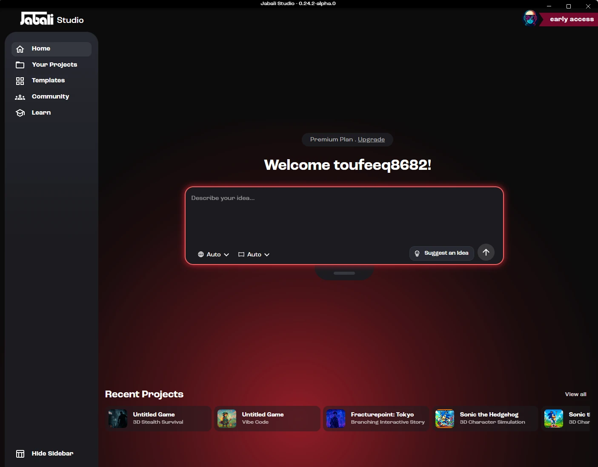

**Create, edit, playtest and publish AI-generated games from your desktop.**

Jabali Studio is the main workspace for building games with Jabali. Start with a prompt, choose a template, or vibe-code a game from scratch with Bali, your AI game creation assistant. Whether you are making a 2D arcade game, an interactive story, a character simulation, a 3D web game or a more advanced Godot project, Jabali Studio gives you the tools to create and iterate in one place.

## What you can do with Jabali Studio

With Jabali Studio, you can:

- Create new games from prompts, your own design documents or popular game templates
- Build 2D or 3D games with the Godot game engine
- Build web games with Phaser, Three.js, React Three Fiber, Babylon.js or PlayCanvas
- Edit scenes, characters, scripts, layouts and assets
- Ask Bali questions about your game
- Generate images, video, music, sound effects, speech and 3D characters with Bali
- Upload your own artwork, audio, video, fonts and 3D models
- Preview and playtest directly in Studio, including on simulated phones and tablets
- Publish your game to Jabali so anyone can play it
- Open games you made on Jabali Web or FriendJam and keep building them

## Meet Bali

Bali is the AI Producer agent built into Jabali Studio. You can use Bali to:

- Turn your prompt into a playable game
- Suggest templates and game structures
- Generate, edit and regenerate content such as images, backgrounds, textures, audio, video and 3D models
- Modify assets, layouts and scripts
- Explain code and game logic
- Help debug issues
- Suggest improvements to pacing, mechanics and story

You choose the AI model Bali uses and how independently it works, and you can extend it with [Agent Skills](/docs/studio/skills/), [MCP servers](/docs/studio/mcp-servers/) and the [Shell tool](/docs/studio/shell/).

Instead of switching between multiple tools, Jabali Studio and Bali give you one place for everything your game needs. Learn more in [Using Bali](/docs/studio/bali/).

## Next steps

1. [Install Jabali Studio](/docs/studio/install/)
2. [Sign in](/docs/studio/sign-in/)
3. [Create your first game](/docs/studio/create-a-game/)
4. [Learn the Studio interface](/docs/studio/interface/)
5. [Get better results from Bali](/docs/studio/bali-best-practices/)

See [What's new](/docs/studio/whats-new/) for the latest features.
