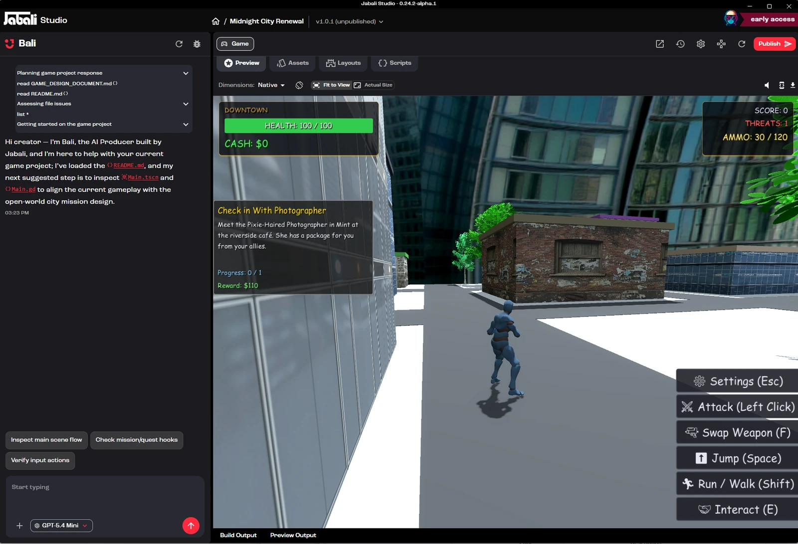
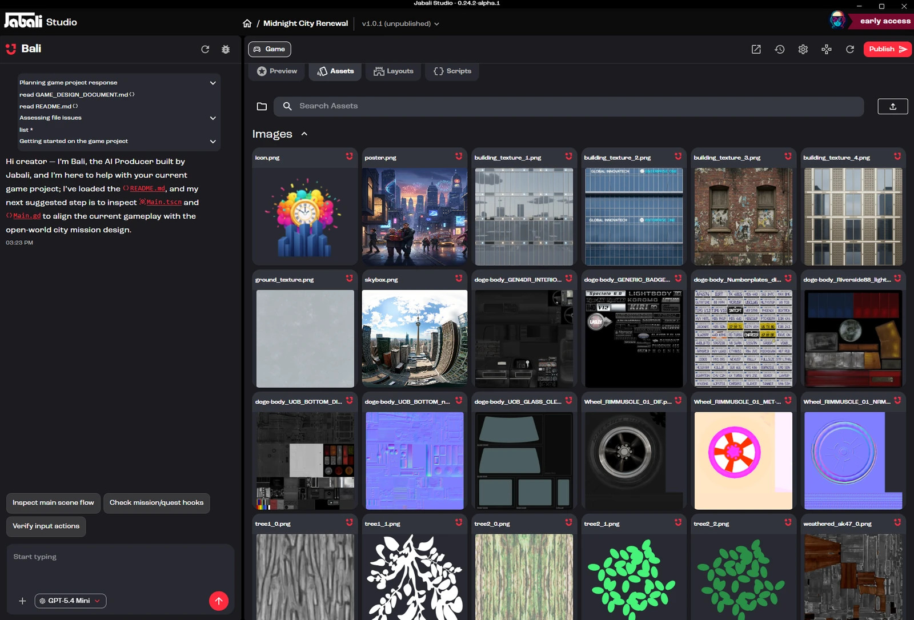
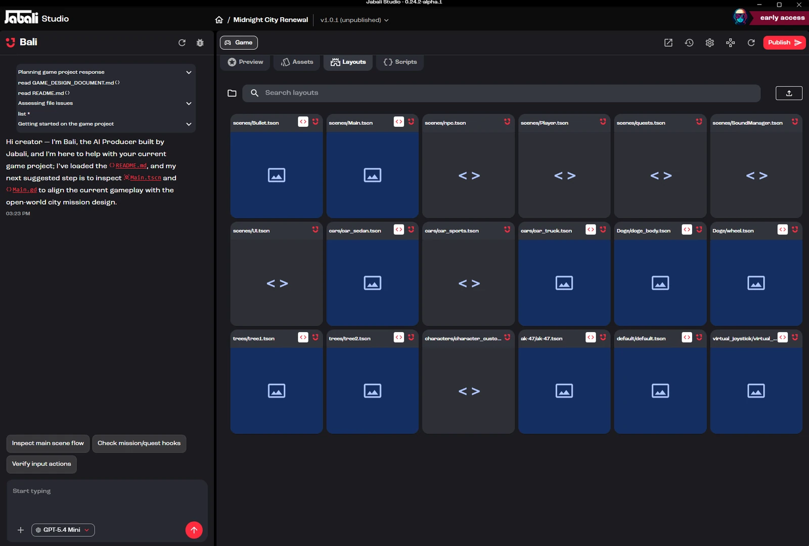
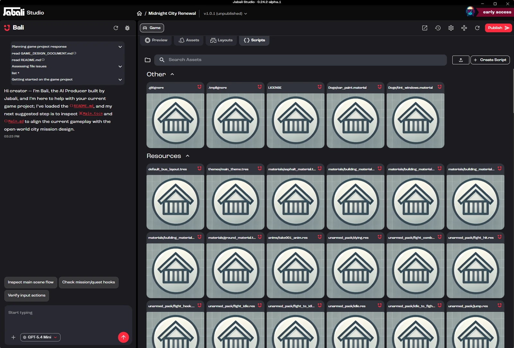
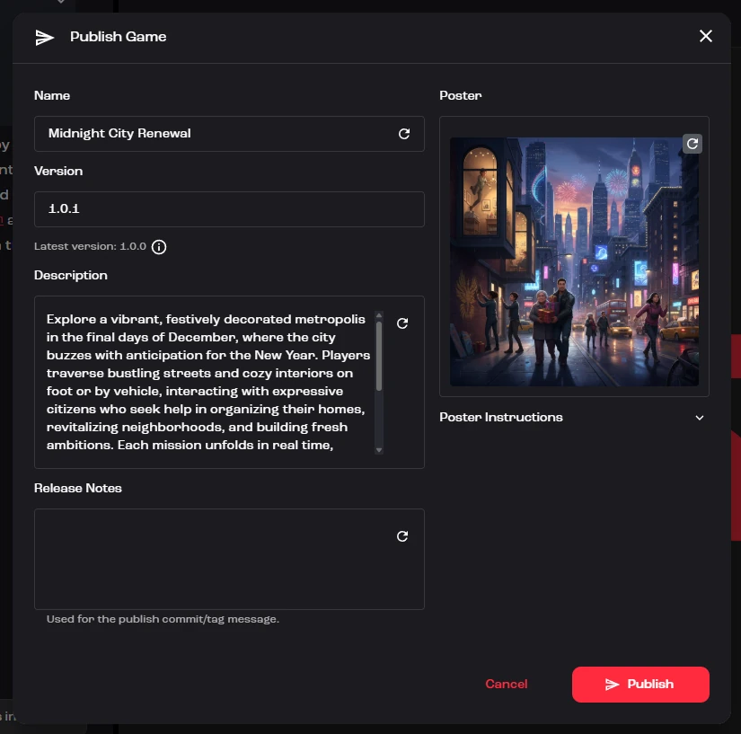

Jabali Studio uses a split-pane interface built for powerful game creation with minimal complexity. Whether you're refining assets, editing gameplay logic or collaborating with Bali, the layout keeps your creative flow uninterrupted.

## Interface structure

The Studio interface has two main panes:

| Pane                               | What it's for                                                          |
| ---------------------------------- | ---------------------------------------------------------------------- |
| **Left pane: Bali (AI Producer)**  | Your AI agent for prompts, questions, edits and creative suggestions   |
| **Right pane: Game Studio**        | The main editing area where you view, modify and manage your project   |

**Watch:** [Tour of Bali's chat, the live preview and logs](https://youtu.be/0MhxWFtoAxw?t=416) (1:28, from the masterclass *How to Build a Game on the Jabali Studio*)

<iframe src="https://www.youtube-nocookie.com/embed/0MhxWFtoAxw?start=416&amp;end=504" title="Video: Tour of Bali's chat, the live preview and logs" loading="lazy" allow="accelerometer; clipboard-write; encrypted-media; gyroscope; picture-in-picture; web-share" referrerpolicy="strict-origin-when-cross-origin" allowfullscreen></iframe>

## Bali's panel (left pane)

Bali lets you work on your game in natural language. In this panel you can:

- Ask questions about assets, levels or logic
- Preview and edit artwork, scenes and scripts
- Generate or regenerate characters, dialogue, layouts and other assets
- Make direct edits using suggestions or follow-up commands

After each reply, Bali offers suggested next steps as buttons under the chat. Click one to send it.

The controls around the chat box:

| Control                         | What it does                                                                                  |
| ------------------------------- | --------------------------------------------------------------------------------------------- |
| **+**                           | **Attach files**, **Add MCP server**, **Add agent skill** or **Take screenshot** of the preview |
| **Model chip** (next to **+**)  | Change the **Model**, **Behavior** and **Reasoning** for this project                          |
| **Reset Thread** (top of panel) | Clear the chat history and start a fresh conversation. Your project isn't affected.            |
| **Report** (bug icon)           | Send a bug report or feedback to the Jabali team                                               |

Learn more in [Using Bali](/docs/studio/bali/), [Attachments](/docs/studio/attachments/) and [Models and behavior](/docs/studio/models-and-behavior/).

## Game editing view (right pane)

This is your central workspace. Tabs run across the top:

| Tab          | Available in               |
| ------------ | -------------------------- |
| **Preview**  | All projects               |
| **Assets**   | All projects               |
| **Layouts**  | Godot projects             |
| **Scripts**  | All projects               |
| **Story**    | Story-based games          |

**Watch:** [Tour of the Preview, Assets, Layouts and Scripts tabs](https://youtu.be/N_1w9K-XIMU?t=318) (2:17, from the masterclass *Mastering Prompt Engineering for Game Creation*)

<iframe src="https://www.youtube-nocookie.com/embed/N_1w9K-XIMU?start=318&amp;end=455" title="Video: Tour of the Preview, Assets, Layouts and Scripts tabs" loading="lazy" allow="accelerometer; clipboard-write; encrypted-media; gyroscope; picture-in-picture; web-share" referrerpolicy="strict-origin-when-cross-origin" allowfullscreen></iframe>

### Preview

See a live preview of your game as it currently exists, including updated visuals, scripts and interactions. Use it to review layout and flow.

Above the preview you'll find:

- **Dimensions**: preview your game at a different screen size. Choose **Native**, a phone (such as iPhone 14 Pro, Pixel 7 or Galaxy S20), a tablet (iPad Air), **FriendJam Mobile**, or a desktop size from 800 × 600 to 1920 × 1080.
- **Rotate**: switch between portrait and landscape on phones and tablets.
- **Fit to View** / **Actual Size**: scale the device to fit the pane, or show it at full size.
- **Mute Audio** / **Unmute Audio**: control the game's sound.
- **Show DevTools**: open the browser developer tools for advanced debugging.

Open the logs to see what your game is printing while it builds and runs. Click **Ask Bali** in the logs to have Bali look at an error.

For Godot projects, a banner tells you when **Build is out of date**. Click **Rebuild** to update the preview. If **Last build failed**, click **Diagnose with Bali** to have Bali find and fix the problem.

### Assets

Browse and manage all game assets, including character sprites, backgrounds, sound files, video, fonts, 3D models and UI elements.

From this tab you can:

- Search your assets and browse them by folder
- Upload new assets with **Upload Asset**, or by dragging files onto the tab
- Regenerate visuals with AI, or click an asset and choose **Edit with Bali**
- Replace or delete files
- Review where an asset came from and the prompt used to create it

See [Create assets](/docs/studio/assets/) for everything Bali can generate.

**Watch:** [Asset details, history and Ask Bali](https://youtu.be/0MhxWFtoAxw?t=504) (1:01, from the masterclass *How to Build a Game on the Jabali Studio*)

<iframe src="https://www.youtube-nocookie.com/embed/0MhxWFtoAxw?start=504&amp;end=565" title="Video: Asset details, history and Ask Bali" loading="lazy" allow="accelerometer; clipboard-write; encrypted-media; gyroscope; picture-in-picture; web-share" referrerpolicy="strict-origin-when-cross-origin" allowfullscreen></iframe>

### Layouts

Godot projects only. View and edit all of the game's layout files, structured as Godot `.tscn` scenes. Each layout corresponds to a scene in the game's story or level structure.

Use this tab for:

- Arranging level geometry
- Positioning characters and objects
- Editing node trees and interaction zones

### Scripts

Explore and modify the game's logic: GDScript in Godot projects, and JavaScript or TypeScript in web projects.

You can:

- Edit game logic for interactions, NPC behavior, scoring, triggers and more
- Upload script files with **Upload Scripts**
- Debug issues with Bali or in the log view
- Save and test changes in real time

**Watch:** [Edit a value by hand, then rebuild](https://youtu.be/VUhvTpTSTcc?t=182) (1:26, from the tutorial *Enhancing Archer Towers: Critical Hits, Visual FX & Balance Tweaks*)

<iframe src="https://www.youtube-nocookie.com/embed/VUhvTpTSTcc?start=182&amp;end=268" title="Video: Edit a value by hand, then rebuild" loading="lazy" allow="accelerometer; clipboard-write; encrypted-media; gyroscope; picture-in-picture; web-share" referrerpolicy="strict-origin-when-cross-origin" allowfullscreen></iframe>

### Story

Appears for story-based games, such as interactive stories. It shows your story's chapters as a flow of connected cards. Use the zoom controls to move around, and double-click a chapter to open it and edit its dialogue.

**Watch:** [Story mode: chapters, lines, choices and jumps](https://youtu.be/0MhxWFtoAxw?t=3308) (0:53, from the masterclass *How to Build a Game on the Jabali Studio*)

<iframe src="https://www.youtube-nocookie.com/embed/0MhxWFtoAxw?start=3308&amp;end=3361" title="Video: Story mode: chapters, lines, choices and jumps" loading="lazy" allow="accelerometer; clipboard-write; encrypted-media; gyroscope; picture-in-picture; web-share" referrerpolicy="strict-origin-when-cross-origin" allowfullscreen></iframe>

## Toolbar

The toolbar in the top-right corner has these controls:

| Control                         | What it does                                                                       |
| ------------------------------- | ---------------------------------------------------------------------------------- |
| **View version history**        | See every change and restore an earlier version. See [Version history](/docs/studio/version-history/). |
| **Open Project Settings**       | Game details, plugins and AI settings for this project. See [Settings](/docs/studio/settings/). |
| **Run in new window**           | Playtest your game in a separate window                                            |
| **Rebuild the project**         | Rebuild and reload the preview with your latest changes                            |
| **Publish**                     | Open the publish dialog                                                            |

Next to the game's title, the version label (for example, *v1.0.1 (unpublished)*) shows the version you're working on. Click it to open version history, or click the title to rename the game.

## Publishing your game

When you're ready, click **Publish** in the top-right corner. Review the name, version number, description, poster and release notes, then confirm.

Publishing:

- Syncs your edits to Jabali's cloud
- Updates the hosted version of your game
- Gives you a playable link to share

See [Publish your game](/docs/studio/publish/) for details.

## Next step

Learn how to get the most out of [Bali](/docs/studio/bali/).
