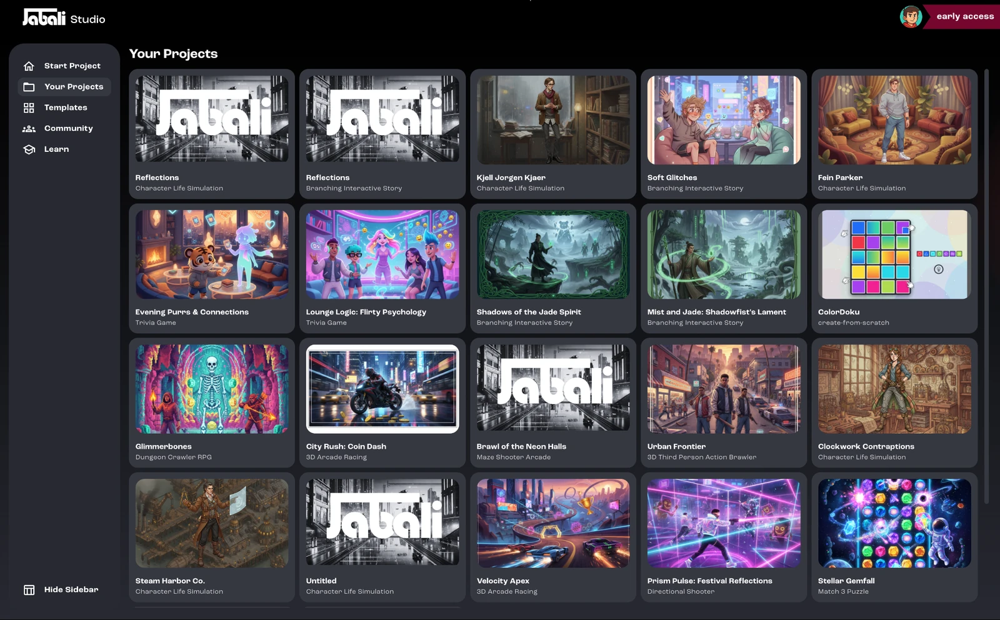
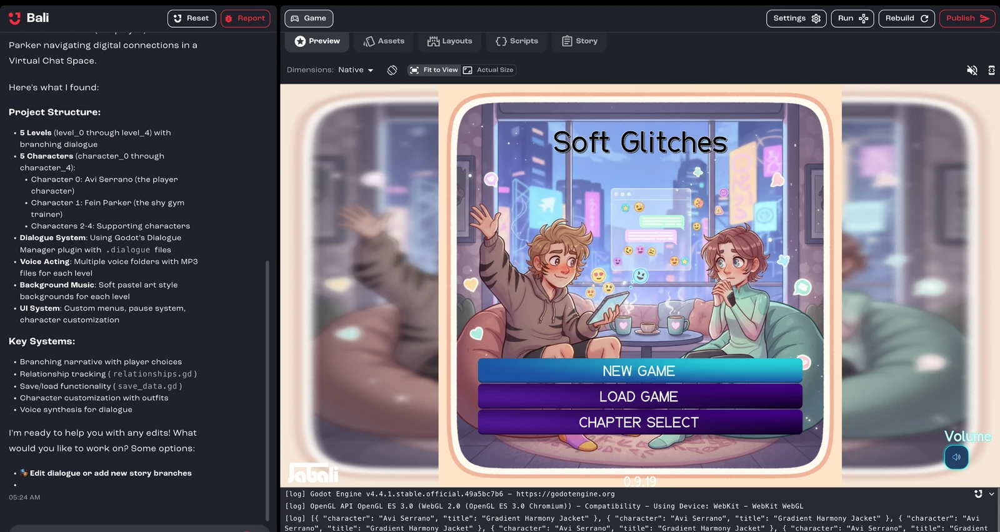

After you sign in, Jabali Studio syncs every game you created on Discord, on Jabali Web or in the desktop app. You'll find them all under **Your Projects**.

## Open a game

1. Click **Your Projects** in the sidebar (recent projects are also listed on the home screen).
2. Click any game in your library.
3. The game opens in Studio, and Bali summarizes the project structure so you can start editing.

:::tip[Don't see your latest game?]
Click **Refresh** in the top-right corner to reload your library. See the [FAQ](/docs/studio/faq/#game-access-and-sync) for more help.
:::

## Next step

Learn your way around the [Studio interface](/docs/studio/interface/).
