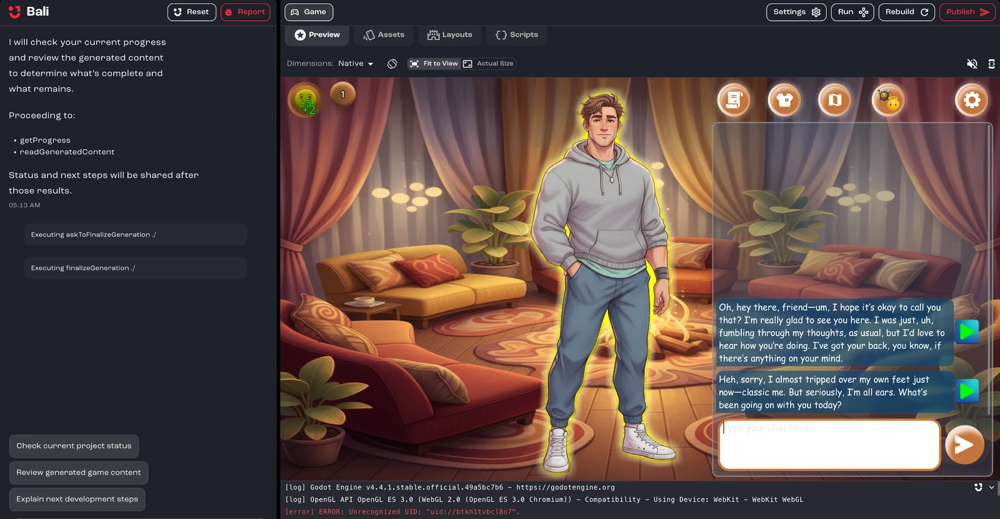

Play your game after every change, while what you just asked Bali for is fresh in your mind. Short, frequent tests catch problems early, when they're easy to describe and quick to fix.

## Play in Studio

The **Preview** tab runs your game inside Studio, with your latest visuals, scripts and interactions. You can play from the start or jump to a specific scene.

To play in a separate window, click **Run in new window** in the toolbar.

:::tip[Wait for Bali to finish]
If you test while Bali is still editing files, you may be running a half-finished change. Wait until Bali finishes, then rebuild and test again.
:::

## Check other screen sizes

Above the preview, you'll find these controls:

- **Dimensions**: preview your game at a different screen size. Choose **Native**, a phone (such as iPhone 14 Pro, Pixel 7 or Galaxy S20), a tablet (iPad Air), **FriendJam Mobile**, or a desktop size from 800 × 600 to 1920 × 1080.
- **Rotate**: switch between portrait and landscape on phones and tablets.
- **Fit to View** / **Actual Size**: scale the device to fit the pane, or show it at full size.
- **Mute Audio** / **Unmute Audio**: control the game's sound.

## Rebuild after changes

For Godot projects, a banner tells you when **Build is out of date**. Click **Rebuild** to update the preview. You can also click **Rebuild the project** in the toolbar at any time.

If **Last build failed**, click **Diagnose with Bali** to have Bali find and fix the problem.

## Read the logs

Open the logs below the preview to see what your game is printing while it builds and runs. Click **Ask Bali** in the logs to have Bali look at an error.

For advanced debugging, click **Show DevTools** above the preview to open the browser developer tools.

To check a published game, open its link in your browser and use the browser's developer console. Bali can't see those logs, so copy any errors into the chat. See [Help Bali see what you see](/docs/studio/debugging/#help-bali-see-what-you-see).

## Play it the way players will

[Publish your game](/docs/studio/publish/) and open its link to play it in a browser, exactly as your players will. You can publish as often as you like, and each publish creates a version you can go back to.

## What to look for

- **Does it match your idea?** Check the core mechanics, content, audio and visuals.
- **Does a new player understand it?** If you need to explain a rule, the game probably should too. See [Polish: what playtesters notice](/docs/studio/design-and-polish/#polish-what-playtesters-notice).
- **Does it run smoothly?** Test 3D games on a computer that isn't built for gaming.
- **What breaks?** Note exactly what you did, what you expected and what happened, then [tell Bali](/docs/studio/debugging/#be-descriptive-when-reporting-bugs).

Play it through more than once. New problems turn up every time.

## Related pages

- [Debug with Bali](/docs/studio/debugging/)
- [Troubleshooting](/docs/studio/troubleshooting/)
- [Studio interface](/docs/studio/interface/)
