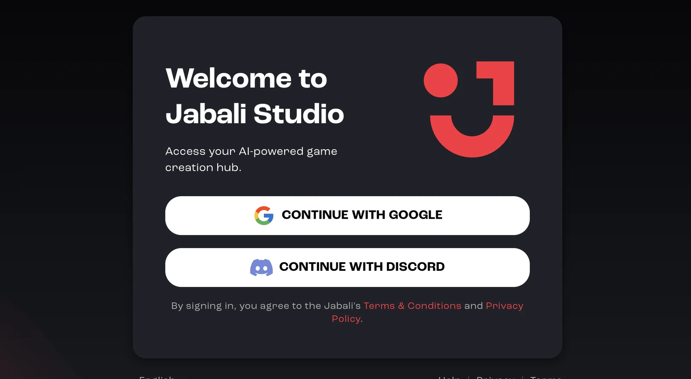

You sign in to Jabali Studio with the same Google or Discord account you use for Jabali. After you sign in, Studio syncs the games you created on Jabali Web, on Discord or in Studio.

:::caution
You need a Jabali account linked to Discord or Google to access your projects.
:::

## How to sign in

1. Launch Jabali Studio.
2. Click **Continue with Google** to use your Google account, or **Continue with Discord** to use Discord.
3. A browser window opens for authentication.
4. Approve the login request in your browser.
5. Return to Studio. Your games sync automatically.

## If sign-in fails

- Restart Jabali Studio and try again.
- If you use Discord, make sure you are logged in to Discord in your default browser, or log out of Discord in your browser and try again.
- Some VPNs and browser privacy settings block the login window. Try disabling them temporarily.

More fixes are in the [Jabali Studio FAQ](/docs/studio/faq/#sign-in-and-account).

## Next step

[Create your first game](/docs/studio/create-a-game/) or [open an existing project](/docs/studio/open-a-project/).
