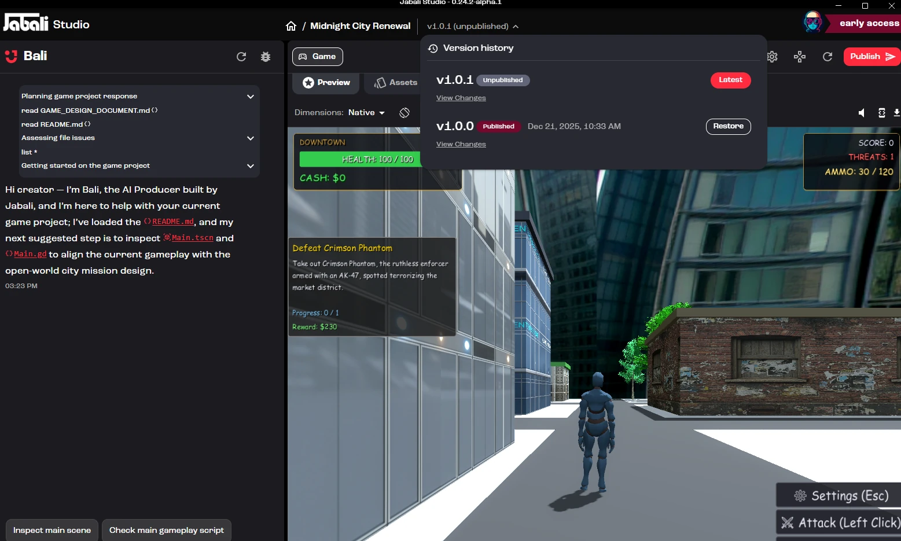

As you build your game in Jabali Studio, you make lots of changes: generating assets, editing scripts, updating layouts, playtesting mechanics and publishing new versions. Version history keeps track of those changes so you can experiment safely, save major milestones and roll back if something goes wrong.

## What is version history?

Version history is the list of saved versions of your current game project. Each version is a snapshot of your game at a point in time and can include changes to:

- Game code
- Assets
- Layouts
- Scripts
- Project configuration
- Published game state

The version history panel shows which version is the **latest**, which version is **published**, and which older versions you can **restore**.

## When should you save a version?

Save often, especially after a major change. A good rule of thumb: **save a new version whenever you would be frustrated to lose the current state of your game.**

Save after changes like:

- Completing a first playable version
- Adding or changing major mechanics
- Generating a new batch of assets
- Editing important scripts
- Reworking level layouts
- Updating the main character or core gameplay loop
- Fixing a major bug
- Publishing a version you want to keep

These saves give you safe checkpoints as your game evolves.

## Recommended versioning workflow

1. **Make a change.** Ask Bali to generate assets, edit scripts, update layouts, or change gameplay or story content.
2. **Preview and test.** Use the **Preview** tab to check the change, and **Run** to playtest.
3. **Save a version** once the change works as expected.
4. **Publish when ready.** Click **Publish** to update the hosted version of your game.
5. **Repeat** and keep iterating with confidence.

## Viewing changes

Click **View Changes** on a version to see what changed. This helps you understand:

- What Bali changed
- Which files were modified
- Whether scripts or layouts were updated
- What changed between the published version and your latest work

:::tip
Before you restore an older version, review its changes so you know what will be affected.
:::

## Restoring an earlier version

To roll back, open the version history panel and click **Restore** next to the version you want to return to.
