Build a 3D game where the player jumps between platforms to escape lava that keeps rising. Part 1 builds the core loop. Part 2 adds the scenery and finishes the game.

**Project tutorial on the [Advanced path](/docs/start/advanced/).** It stands on its own, so you can start here.

**You'll learn how to:** start a 3D game from a template, fix controls and errors with Bali, add mechanics step by step, and make sure generated assets end up in the game.

:::note[Recorded on an earlier version]
The screenshots and videos come from an earlier version of Jabali Studio, so some screens look different today. **Current app** notes explain what changed.
:::

## Part 1: Build the core loop

Prefer to watch? Play the part 1 video (40 min)

<iframe src="https://www.youtube-nocookie.com/embed/y5oDck88fhY" title="Video: Build a 3D game from scratch, part 1" loading="lazy" allow="accelerometer; clipboard-write; encrypted-media; gyroscope; picture-in-picture; web-share" referrerpolicy="strict-origin-when-cross-origin" allowfullscreen></iframe>

### Step 1: Describe a 3D concept

Describe the game, the goal and how the player scores. The video uses this prompt:

> I'd like to create a 3D game that is similar to a Floor is Lava concept. The player has to navigate across a series of platforms to reach a final "home" or "safe" zone. The lava is on the ground level. The player must not fall to the lava or they will die. For each platform the player crosses safely they will gain a set number of points that add to their score.

Bali confirms it's a 3D game and summarizes the concept.

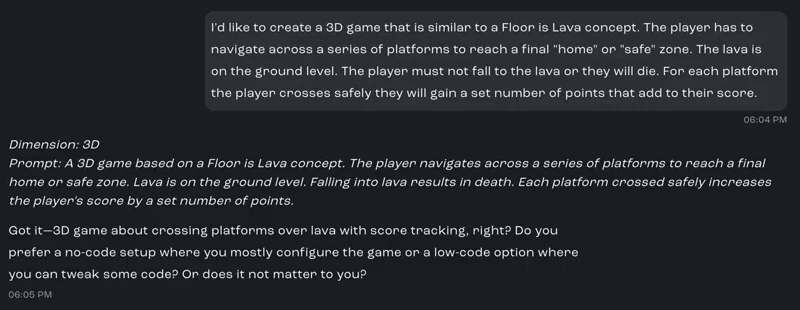

[Watch this step (01:01)](https://youtu.be/y5oDck88fhY?t=61)

### Step 2: Pick a 3D template

Studio recognizes that you want a 3D game and shortlists 3D templates to start from. The video picks **Third Person Action**, because it only needs a basic third-person camera that follows the player from platform to platform.

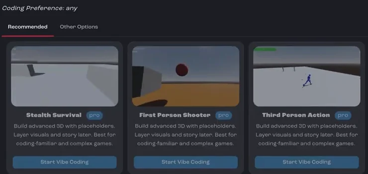

[Watch this step (01:17)](https://youtu.be/y5oDck88fhY?t=77)

:::note[Current app]
Under the prompt box, choose **Camera** → **3D**, or browse **Templates** in the sidebar. See [Create your first game](/docs/studio/create-a-game/).
:::

### Step 3: Let Studio adapt the template

Studio changes the template to match the details in your prompt. This takes a few minutes.

[Watch this step (03:31)](https://youtu.be/y5oDck88fhY?t=211)

### Step 4: Play the first version

The first result is already a basic version of the game: a lava floor that rises, platforms, and a character that can jump.

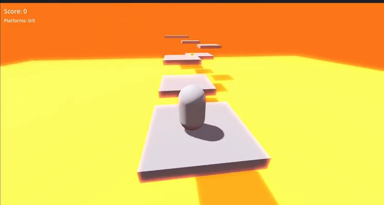

[Watch this step (06:14)](https://youtu.be/y5oDck88fhY?t=374)

### Step 5: Generate textures and audio

Bali offers to generate the art and sound the game needs: textures for the lava, the platforms and the safe zone (the home platform the player is trying to reach), plus music, sound effects for death and other moments, and the ambient sound of the rising lava. Review each request and generate them.

[Watch this step (07:40)](https://youtu.be/y5oDck88fhY?t=460)

### Step 6: Fix the controls

When you test the game, the character's movement doesn't work properly. Ask Bali to fix it, and say exactly which controls you want:

> Can you make sure that I can use the arrow keys to move forward/backwards/left and right and the mouse to change my camera view

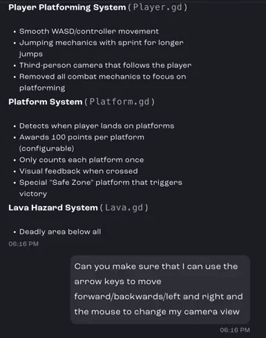

[Watch this step (11:29)](https://youtu.be/y5oDck88fhY?t=689)

### Step 7: Ask Bali to debug errors

Sometimes the code Bali writes has errors. When they show up, ask Bali to debug the issue and check the preview logs. It reads the errors and fixes the code.

[Watch this step (15:41)](https://youtu.be/y5oDck88fhY?t=941)

### Step 8: Make the lava rise with each platform

With the controls working, add the next mechanic: the lava rises each time the player reaches a new platform. Going back is no longer an option, which adds urgency.

[Watch this step (18:29)](https://youtu.be/y5oDck88fhY?t=1109)

### Step 9: Add moving platforms

Make some platforms move slowly, so they're harder to reach. After a bit of debugging with Bali, both new features work.

[Watch this step (18:45)](https://youtu.be/y5oDck88fhY?t=1125)

### Step 10: Make the rising lava obvious

Players should notice when the lava rises. Ask Bali to make it more visible with an animation and an on-screen notice.

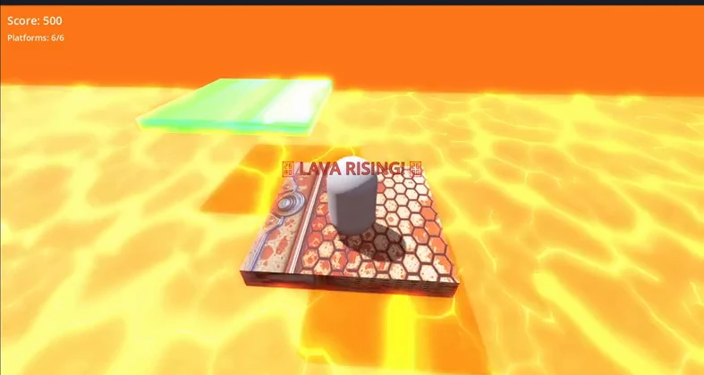

[Watch this step (25:47)](https://youtu.be/y5oDck88fhY?t=1547)

### Step 11: Check the assets are in the game

Generated files aren't always wired into the game straight away. Ask Bali to make sure all the assets you generated earlier are actually used. You can see them in the **Assets** tab.

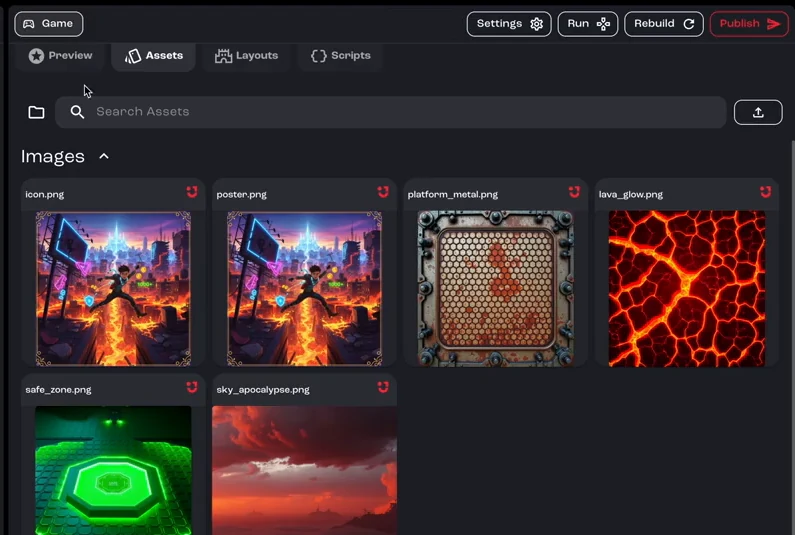

[Watch this step (28:11)](https://youtu.be/y5oDck88fhY?t=1691)

### Step 12: Adjust the look

Once the assets show up, ask Bali to tweak them to fit your idea, such as their transparency or brightness.

[Watch this step (31:02)](https://youtu.be/y5oDck88fhY?t=1862)

### Step 13: Add power-ups

Finally, add a new collectible: power-ups that lower the lava slightly or make the player's jumps higher, and add to the score.

[Watch this step (36:51)](https://youtu.be/y5oDck88fhY?t=2211)

## Part 2: Scenery and finishing touches

Prefer to watch? Play the part 2 video (19 min)

<iframe src="https://www.youtube-nocookie.com/embed/BMA3t_YWwik" title="Video: Build a 3D game from scratch, part 2" loading="lazy" allow="accelerometer; clipboard-write; encrypted-media; gyroscope; picture-in-picture; web-share" referrerpolicy="strict-origin-when-cross-origin" allowfullscreen></iframe>

Part 2 starts with a working game: cross the platforms and reach the green safe zone to win.

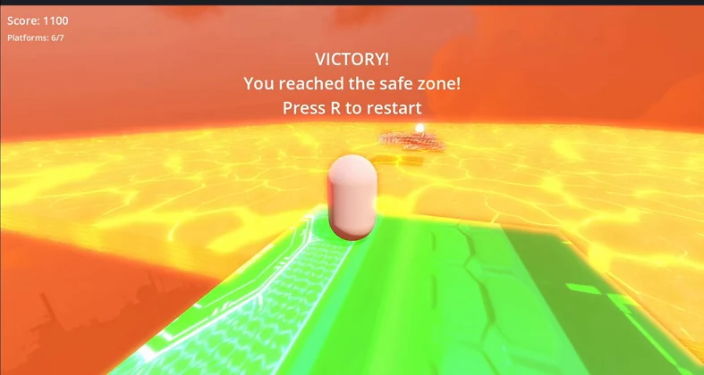

### Step 1: Add buildings around the track

Ask Bali to add buildings around the track. They give the player something to measure the rising lava against, so it's easier to notice.

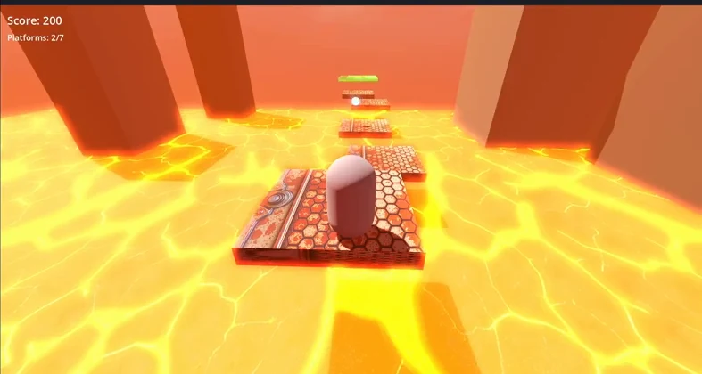

[Watch this step (03:17)](https://youtu.be/BMA3t_YWwik?t=197)

### Step 2: Texture the buildings

Ask Bali to generate textures for the buildings, with windows, silhouettes and other details that fit the post-apocalyptic theme. Review each prompt in the asset generator, then click **Generate**.

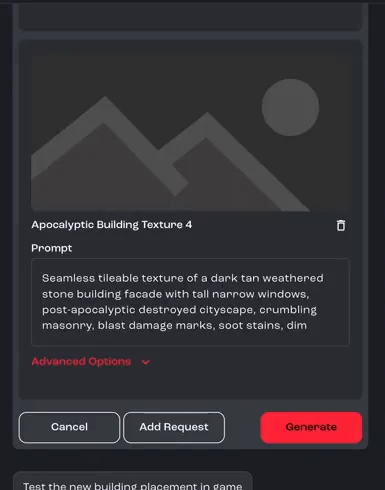

[Watch this step (06:53)](https://youtu.be/BMA3t_YWwik?t=413)

### Step 3: Review the finished loop

Play the game. The lava rises a little each time the player moves to a new platform, and the rise is easy to see against the buildings.

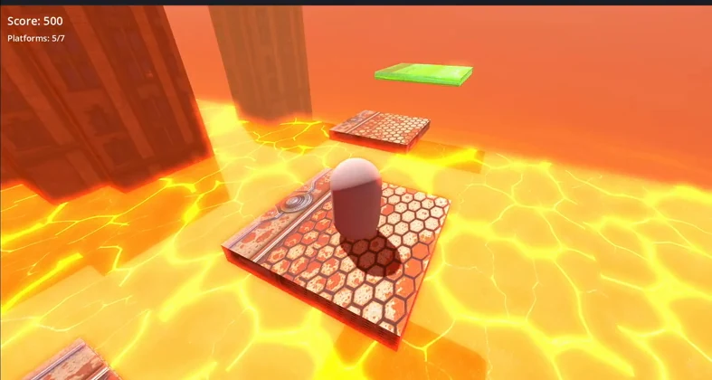

[Watch this step (12:03)](https://youtu.be/BMA3t_YWwik?t=723)

### Step 4: Replace the skybox

Finally, ask for a nicer, more seamless sky. In the video, Bali generates a 360-degree post-apocalyptic sky with smoke, ash clouds and a burning city on the horizon.

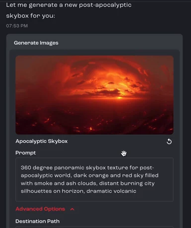

[Watch this step (16:46)](https://youtu.be/BMA3t_YWwik?t=1006)

:::note[Current app]
Bali now picks skyboxes from a library of ready-made ones, which is faster and uses fewer Sparks. To create a completely custom sky, ask Bali to generate an image instead. See [Add skyboxes to 3D games](/docs/studio/assets/skyboxes/).
:::

You now have a complete 3D game with generated images, music and sound effects, a collectible mechanic, custom controls and a rising-lava loop. When you're happy with it, [publish](/docs/tutorials/publish-a-game/) it.

## Related pages

- [Add skyboxes to 3D games](/docs/studio/assets/skyboxes/)
- [Bali best practices](/docs/studio/bali-best-practices/)
