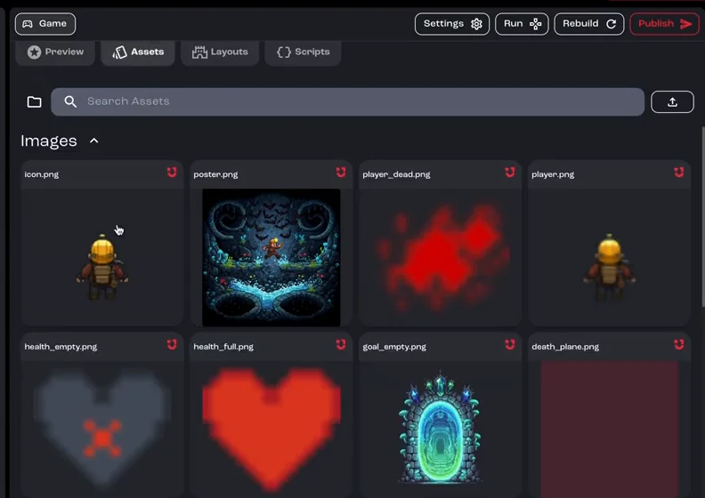
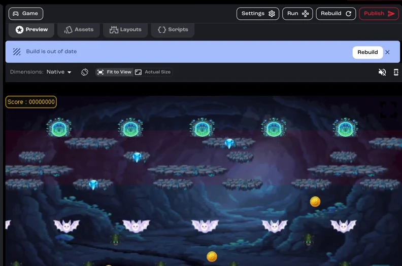

Create a new player character with AI, make it the hero of your game, and update the poster to match.

**You'll learn how to:** review the art you already have, describe and refine a new character, swap it into the game, and keep your poster consistent.

:::note[Recorded on an earlier version]
The screenshots and video come from an earlier version of Jabali Studio, so some screens look different today.
:::

<details>
<summary>Prefer to watch? Play the full video (9 min)</summary>

<div class="video-embed"><iframe src="https://www.youtube-nocookie.com/embed/3XUVb_-TxdY" title="Video: Generate characters and art" loading="lazy" allow="accelerometer; clipboard-write; encrypted-media; gyroscope; picture-in-picture; web-share" referrerpolicy="strict-origin-when-cross-origin" allowfullscreen></iframe></div>

</details>

## Step 1: Review the art you already have

Open the **Assets** tab to browse the game's art visually. Or ask Bali to do it for you:

```text wrap
Scan the project and summarize the key art, characters and obstacles.
```



[Watch this step (00:00)](https://youtu.be/3XUVb_-TxdY?t=0)

## Step 2: Describe the new character

Tell Bali who the new hero is: their personality, look and outfit. The video asks for a tough, adventurous spelunker who is clearly ready to explore. For example:

```text wrap
Generate a new player character: a tough, adventurous explorer in rugged gear, clearly ready to explore the caves.
```

Mention the view your game uses. This game shows the player from above, so the new sprite needs to be drawn from the back.

[Watch this step (00:58)](https://youtu.be/3XUVb_-TxdY?t=58)

## Step 3: Review and refine the image prompt

The asset generator opens in the chat and shows how Bali turned your request into an image prompt. If you like it, click **Generate**. If not, edit the prompt or regenerate as many times as you need until the character feels right.

[Watch this step (01:56)](https://youtu.be/3XUVb_-TxdY?t=116)

## Step 4: Make it the player character

When you're happy with the new image, ask Bali to swap it into the game as the active player character. Bali wires it in and adjusts the size, aspect ratio and alignment so it fits the existing scenes.

When Studio shows **Build is out of date** above the preview, click **Rebuild** to see the change.



[Watch this step (04:20)](https://youtu.be/3XUVb_-TxdY?t=260)

## Step 5: Update the poster

Keep your key art consistent with the new look. One prompt is enough:

```text wrap
Regenerate the poster so it shows the new hero.
```

[Watch this step (06:40)](https://youtu.be/3XUVb_-TxdY?t=400)

## Step 6: Test, then publish

Play the game once more in the **Preview** tab, then [publish](/docs/tutorials/publish-a-game/) it to share your updated adventure.

[Watch this step (08:49)](https://youtu.be/3XUVb_-TxdY?t=529)

## Related pages

- [Generate and edit images](/docs/studio/assets/images/)
- [Create game assets](/docs/studio/assets/)
- [Publish your game](/docs/studio/publish/)
