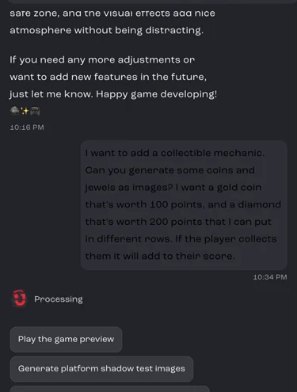
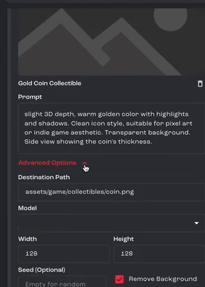
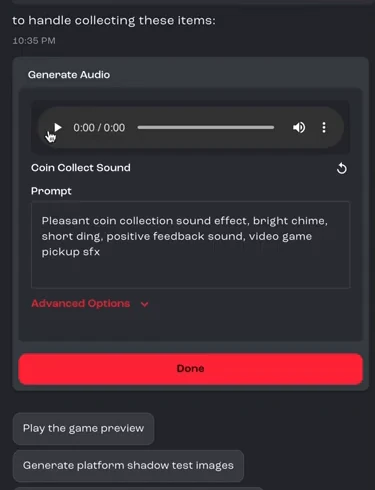
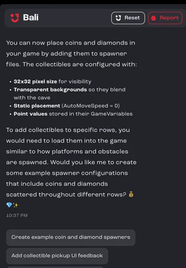
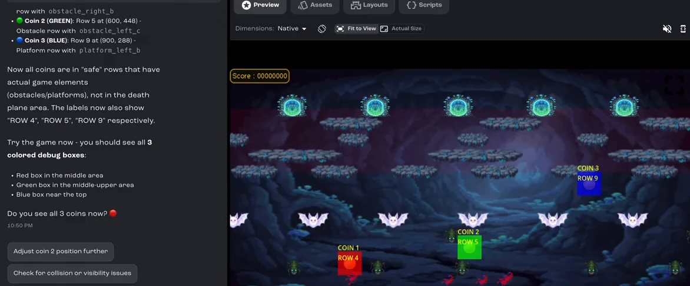
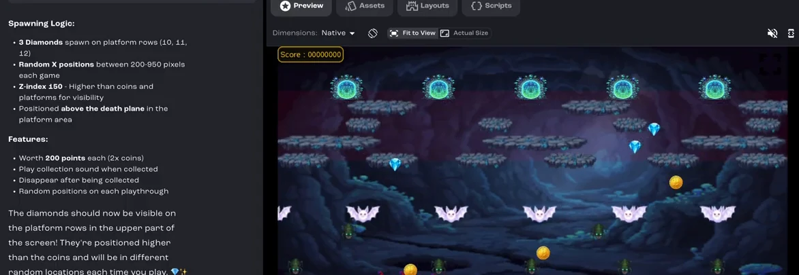

Add coins and diamonds that players collect for points. Bali generates the art and sound, writes the logic, and helps you debug it when something doesn't work the first time.

**Cave arcade game, part 4 of 6.** Each part builds on the one before. See [all tutorials](/docs/tutorials/).

**You'll learn how to:** describe a new mechanic so Bali gets it right, generate images and sounds as part of a feature, and use on-screen labels and logs to track down a bug.

:::note[Recorded on an earlier version]
The screenshots and video come from an earlier version of Jabali Studio, so some screens look different today.
:::

Prefer to watch? Play the full video (15 min)

<iframe src="https://www.youtube-nocookie.com/embed/ZphMe5ubZ1s" title="Video: Add collectibles and scoring" loading="lazy" allow="accelerometer; clipboard-write; encrypted-media; gyroscope; picture-in-picture; web-share" referrerpolicy="strict-origin-when-cross-origin" allowfullscreen></iframe>

## Step 1: Describe the mechanic in detail

For a new feature, the more specific your prompt, the better Bali's first attempt. Say what the player collects, what each item is worth and where it should appear. The video uses this prompt:

> I want to add a collectible mechanic. Can you generate some coins and jewels as images? I want a gold coin that's worth 100 points, and a diamond that's worth 200 points that I can put in different rows. If the player collects them it will add to their score.

[Watch this step (00:00)](https://youtu.be/ZphMe5ubZ1s?t=0)

## Step 2: Generate the collectible images

The asset generator opens with a request for each item and a prompt Bali wrote. Under **Advanced Options** you can see where each file will be saved and its size. **Remove Background** is turned on, so the items blend into the game. Edit the prompts if you like, then click **Generate**.

[Watch this step (00:35)](https://youtu.be/ZphMe5ubZ1s?t=35)

## Step 3: Add a pickup sound

Once the images are done, Bali carries on with the feature and asks for a sound effect to play when the player collects an item. Play the sound in the card to preview it. If you want something different, change the prompt and generate it again. Click **Done** to move on.

[Watch this step (01:08)](https://youtu.be/ZphMe5ubZ1s?t=68)

## Step 4: Let Bali write the logic

With the art and sound ready, Bali already knows what the mechanic should do. It writes the code for detecting when the player touches an item, awarding points and updating the score.

[Watch this step (02:11)](https://youtu.be/ZphMe5ubZ1s?t=131)

## Step 5: Choose where the items appear

Bali pauses to ask how the items should spawn. It suggests options such as fixed positions, patterns along rows, or items that move.

[Watch this step (03:19)](https://youtu.be/ZphMe5ubZ1s?t=199)

## Step 6: Start simple

Begin with items that don't move. The player has to time their run, dodge the obstacles and pass through the item's position to pick it up.

[Watch this step (03:50)](https://youtu.be/ZphMe5ubZ1s?t=230)

## Step 7: Playtest and spot the problem

On the first test, only one coin appears on screen, so something in the spawn logic isn't right yet. Describe exactly what you see when you tell Bali.

[Watch this step (05:47)](https://youtu.be/ZphMe5ubZ1s?t=347)

## Step 8: Debug with labels and logs

Ask Bali to add logging and to label each coin on screen, so you can see which coins spawn and where. In the video, the labels showed that some coins were spawning in the danger zone, so Bali moved them into rows with obstacles or platforms. When everything works, ask Bali to remove the debug labels.

[Watch this step (06:38)](https://youtu.be/ZphMe5ubZ1s?t=398)

## Step 9: Nudge the positions

Small adjustments are quick to ask for. The video moves the coins up slightly so they sit in the middle of their rows and feel better to run through.

[Watch this step (08:10)](https://youtu.be/ZphMe5ubZ1s?t=490)

## Step 10: Add a second item with a different rule

Now add diamonds with their own spawning rule: they stay on the moving platforms they spawn on, so the player has to get onto the right platform to collect them.

[Watch this step (09:57)](https://youtu.be/ZphMe5ubZ1s?t=597)

## Step 11: Refine until it's right

A second mechanic layered on top of the first takes more back and forth. Keep refining your prompts until it works. In the video, it takes a few rounds before all three diamonds spawn and move the way they should.

[Watch this step (13:00)](https://youtu.be/ZphMe5ubZ1s?t=780)

## Step 12: Playtest, then publish

Play the game again in the **Preview** tab. When everything looks good, [publish](/docs/tutorials/publish-a-game/) the updated game.

[Watch this step (14:25)](https://youtu.be/ZphMe5ubZ1s?t=865)

## Related pages

- [Bali best practices](/docs/studio/bali-best-practices/)
- [Generate and edit images](/docs/studio/assets/images/)
- [Generate music, sound effects and speech](/docs/studio/assets/audio/)
