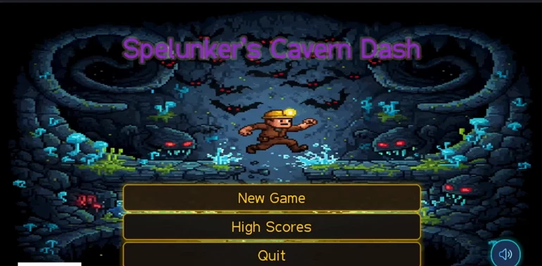
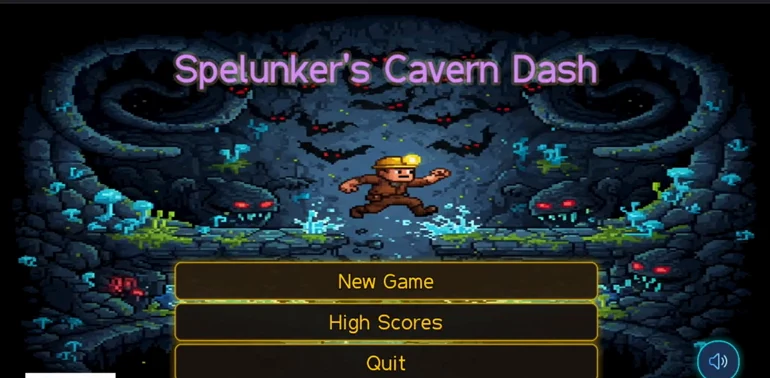
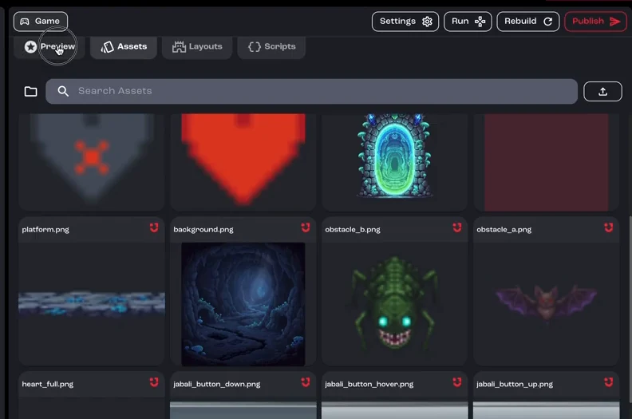
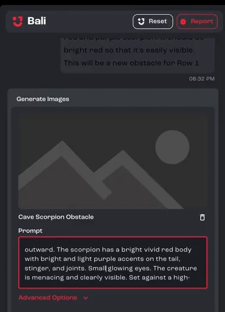
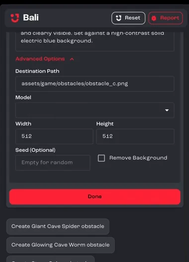
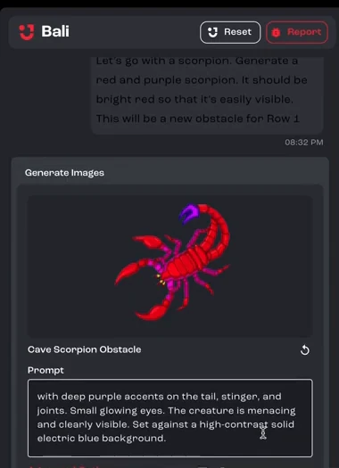
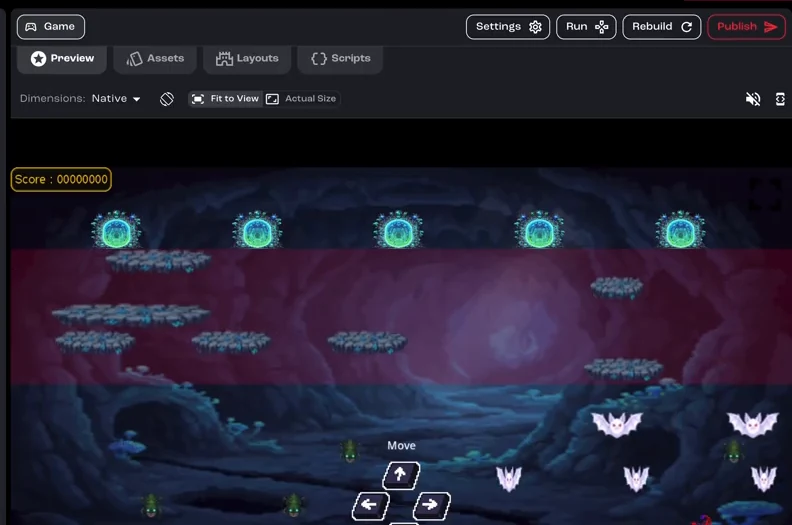
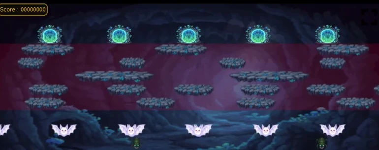
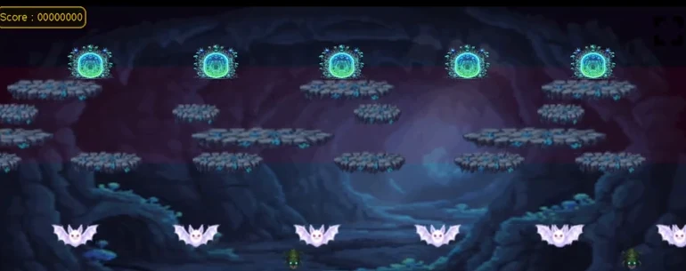

Open an existing lane-based arcade game and improve it by asking Bali in plain words. Part 1 changes the visuals and adds a new enemy. Part 2 tunes the movement and difficulty.

**You'll learn how to:** change visuals by asking, find out how your game is put together, generate and add a new enemy, and fix vague problems without digging through files.

:::note[Recorded on an earlier version]
The screenshots and videos come from an earlier version of Jabali Studio, so some screens look different today.
:::

## Part 1: Change visuals and add an enemy

<details>
<summary>Prefer to watch? Play the part 1 video (7 min)</summary>

<div class="video-embed"><iframe src="https://www.youtube-nocookie.com/embed/Hg7U7JBunjo" title="Video: Customize a game, part 1" loading="lazy" allow="accelerometer; clipboard-write; encrypted-media; gyroscope; picture-in-picture; web-share" referrerpolicy="strict-origin-when-cross-origin" allowfullscreen></iframe></div>

</details>

### Step 1: Make the title easier to read

The title on the start screen is dim and hard to read. Instead of hunting through settings, ask Bali:

```text wrap
Make the title a brighter, lighter purple so it really pops.
```

Bali applies the change and rebuilds the game, so you see the new title in the preview right away.





[Watch this step (00:13)](https://youtu.be/Hg7U7JBunjo?t=13)

### Step 2: Add something the template doesn't have

You aren't limited to what the template includes. For example:

```text wrap
Make the title text pulse in a spooky, eye-catching way.
```

Bali writes the animation and you can watch it running in the **Preview** tab.

[Watch this step (00:35)](https://youtu.be/Hg7U7JBunjo?t=35)

### Step 3: Make the player bigger

Ask for a change in everyday terms, such as *"Make the player about 50% bigger."* Bali finds where the player is defined and which scenes use it, then scales it. In the video, it also enlarged the player's collision box to match the new size.

[Watch this step (01:24)](https://youtu.be/Hg7U7JBunjo?t=84)

### Step 4: Find out how the obstacles work

Before changing something, ask Bali to explain it. For example: *"Break down the obstacles in this game and how they're used."* Bali describes each obstacle and where it appears.

You can also browse every image in the project in the **Assets** tab.



[Watch this step (01:50)](https://youtu.be/Hg7U7JBunjo?t=110)

### Step 5: Regenerate an obstacle

Ask Bali to redraw an existing asset and say what should change:

```text wrap
Regenerate the bat obstacle so it stands out more: a stronger silhouette and a clearer shape, while still matching the game's style.
```

[Watch this step (02:22)](https://youtu.be/Hg7U7JBunjo?t=142)

### Step 6: Find where an asset is used

Ask *"Which rows use the bat obstacle?"* Bali searches the whole project, matches the asset to the rows that spawn it, and tells you where it appears. You don't need to read any code.

[Watch this step (03:02)](https://youtu.be/Hg7U7JBunjo?t=182)

### Step 7: Ask Bali to suggest a new enemy

To replace the obstacle on row one with something new, ask Bali for ideas. Bali uses what it knows about your project to suggest creatures that fit the theme and difficulty.

[Watch this step (03:48)](https://youtu.be/Hg7U7JBunjo?t=228)

### Step 8: Generate the new enemy

When you pick an idea, the asset generator opens in the chat with a prompt Bali wrote. Edit the prompt to add your own details. The video adds glowing yellow eyes.



Open **Advanced Options** to see where the file will be saved and change its size. For a sprite, turn on **Remove Background** so it blends into the game. Then click **Generate**.



[Watch this step (04:24)](https://youtu.be/Hg7U7JBunjo?t=264)

### Step 9: Accept it and let Bali wire it in

Bali came back with a red scorpion with two tails. If you don't like the result, regenerate it. When you're happy, click **Done**. Bali adds the new asset to the game where you asked for it.



[Watch this step (05:00)](https://youtu.be/Hg7U7JBunjo?t=300)

### Step 10: Give the new enemy its own movement

Describe how it should move, for example *"Give the scorpion a jittery movement pattern."* The template has no movement like that, so Bali writes the script it needs.

[Watch this step (05:34)](https://youtu.be/Hg7U7JBunjo?t=334)

### Step 11: Tune the movement

Getting movement to feel right usually takes a few rounds. Play the game, then tell Bali what to adjust, such as the speed, the timing or how strong the jitter is.

[Watch this step (06:17)](https://youtu.be/Hg7U7JBunjo?t=377)

## Part 2: Refine, balance and polish

<details>
<summary>Prefer to watch? Play the part 2 video (9 min)</summary>

<div class="video-embed"><iframe src="https://www.youtube-nocookie.com/embed/q5EMnBps-4M" title="Video: Customize a game, part 2" loading="lazy" allow="accelerometer; clipboard-write; encrypted-media; gyroscope; picture-in-picture; web-share" referrerpolicy="strict-origin-when-cross-origin" allowfullscreen></iframe></div>

</details>

### Step 1: Play the game

Play the game in the **Preview** tab to feel how your changes fit together.



[Watch this step (00:00)](https://youtu.be/q5EMnBps-4M?t=0)

### Step 2: Fine-tune the new enemy

Which tweaks you make is up to you. In the video, a few rounds with Bali adjust the scorpion's movement and starting position until it behaves as intended.

[Watch this step (00:22)](https://youtu.be/q5EMnBps-4M?t=22)

### Step 3: Lower the difficulty

If the game feels too hard, say what to change. The video asks Bali to remove the obstacle from row three, giving the player a breather, and to slow the scorpion down slightly.

[Watch this step (02:14)](https://youtu.be/q5EMnBps-4M?t=134)

### Step 4: Make a loose request

You don't need to know file names. The video asks:

```text wrap
Make the red tint behind the platforms more transparent.
```

Bali searches the code and assets for the layer behind the platforms, works out that you mean the danger-zone image, and lowers its opacity.





The more you prompt, the better you get at asking for exactly what you need, even when a request starts out vague.

[Watch this step (03:45)](https://youtu.be/q5EMnBps-4M?t=225)

### Step 5: Playtest, then publish

Play the game once more. When you're happy with it, you're ready to [publish](/docs/tutorials/publish-a-game/).

[Watch this step (08:30)](https://youtu.be/q5EMnBps-4M?t=510)

## Related pages

- [Using Bali](/docs/studio/bali/)
- [Bali best practices](/docs/studio/bali-best-practices/)
- [Generate and edit images](/docs/studio/assets/images/)
