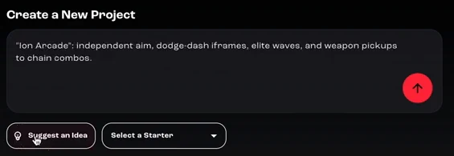
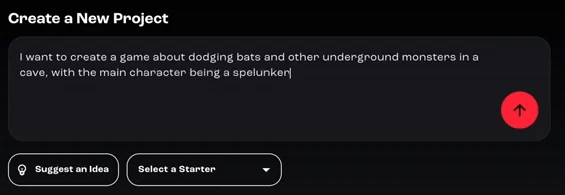
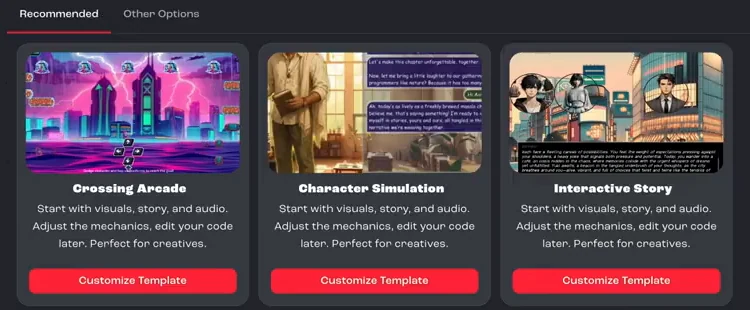
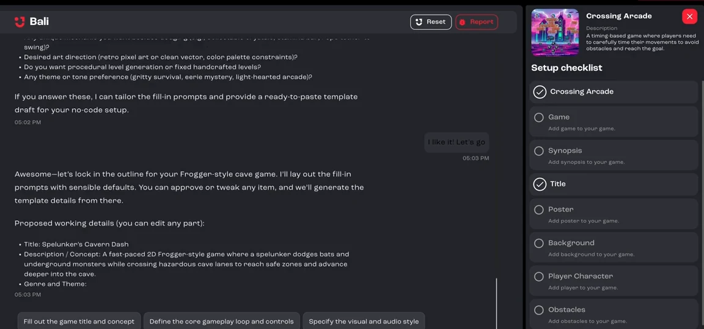
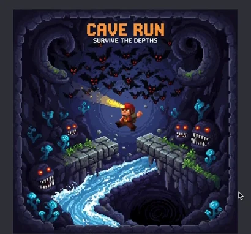
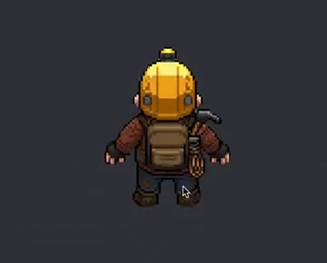
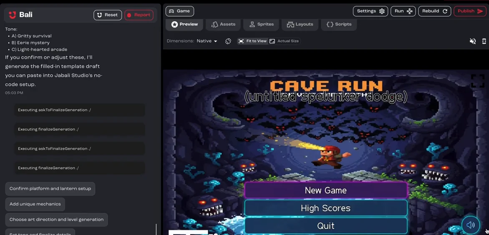

Go from an idea to a playable game in a few minutes. You'll describe a lane-based arcade game, where a spelunker dodges monsters and bats underground, and let Bali generate the title, art and poster for you.

**You'll learn how to:** describe a game idea, answer Bali's setup questions, let Bali finish the setup, and playtest the result.

:::note[Recorded on an earlier version]
The screenshots and video come from an earlier version of Jabali Studio, so some screens look different today. **Current app** notes explain what changed.
:::

Prefer to watch? Play the full video (2 min)

<iframe src="https://www.youtube-nocookie.com/embed/6ReO4TOuPrM" title="Video: Make your first game" loading="lazy" allow="accelerometer; clipboard-write; encrypted-media; gyroscope; picture-in-picture; web-share" referrerpolicy="strict-origin-when-cross-origin" allowfullscreen></iframe>

## Step 1: Start with an idea

On the home screen, type your idea into the prompt box. If you don't have one yet, click **Suggest an Idea** and Bali proposes a concept. Click it again for a different one.

[Watch this step (00:00)](https://youtu.be/6ReO4TOuPrM?t=0)

## Step 2: Describe your game

In one or two sentences, say what kind of game it is, where it's set, who the main character is and what the player does. The video uses this prompt:

> I want to create a game about dodging bats and other underground monsters in a cave, with the main character being a spelunker

Click the arrow button to send it.

[Watch this step (00:12)](https://youtu.be/6ReO4TOuPrM?t=12)

:::note[Current app]
The home screen now has **Engine** and **Camera** options under the prompt box. Choose **Camera** → **2D** for a lane-based game like this one, or leave both on **Let Bali Decide**. See [Create your first game](/docs/studio/create-a-game/).
:::

## Step 3: Answer Bali's questions and pick a template

Bali asks a few questions to understand what you want, such as whether the game is 2D or 3D and how much code you want to write yourself. The video picks 2D, because the player moves in tight lanes, and a no-code approach, so Bali handles the art, audio and code.

Bali then recommends templates that fit your idea. Pick one and click **Customize Template**. The video uses **Crossing Arcade**, which suits a lane-crossing game like this one.

[Watch this step (00:32)](https://youtu.be/6ReO4TOuPrM?t=32)

## Step 4: Let Bali finish the setup

Bali proposes working details for your game, including a title, a short description, the genre and the theme, and starts filling in the **Setup checklist** on the right: the game, synopsis, title, poster, background, player character, obstacles and more.

You can approve or change any item. To see what Bali makes on its own, click **Finish with AI**. Bali generates everything that's left. This can take a few minutes, and it carries on in the background if you go back to the home screen.

[Watch this step (00:38)](https://youtu.be/6ReO4TOuPrM?t=38)

## Step 5: Check what Bali created

As each item is generated, click it in the checklist to see the result and the prompt Bali used. In the video, Bali created a cave background, a poster with the bats, cave and monsters from the prompt, and a spelunker character with a helmet lamp.

[Watch this step (00:59)](https://youtu.be/6ReO4TOuPrM?t=59)

## Step 6: Playtest your game

When everything is generated, the game opens on the **Preview** tab. Click **New Game** and play it straight away.

[Watch this step (01:31)](https://youtu.be/6ReO4TOuPrM?t=91)

## Step 7: Keep improving it with Bali

From here, ask Bali in the chat on the left for whatever you want to change: new visuals, a different difficulty, or a fresh version of any asset. The next tutorial shows how.

[Watch this step (01:47)](https://youtu.be/6ReO4TOuPrM?t=107)

## Next steps

- [Customize and polish a game](/docs/tutorials/customize-a-game/)
- [Publish your game](/docs/tutorials/publish-a-game/)
