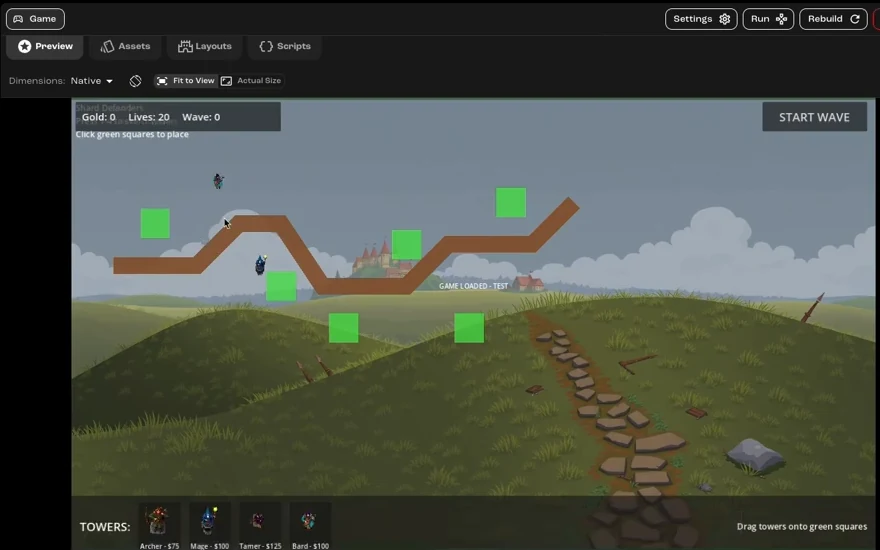
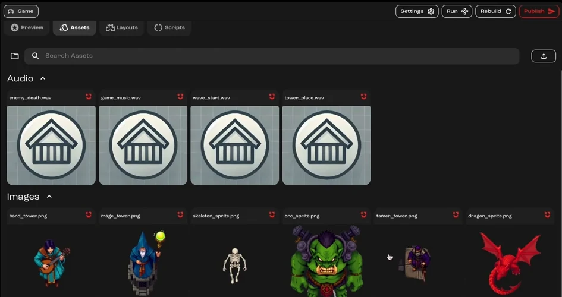
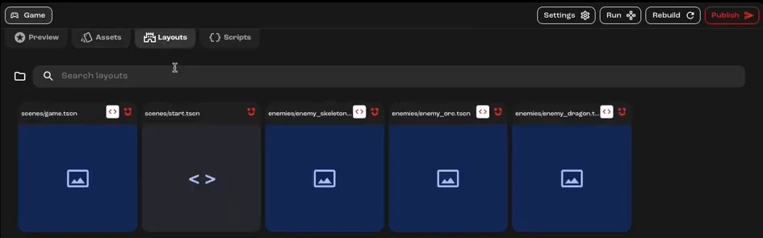
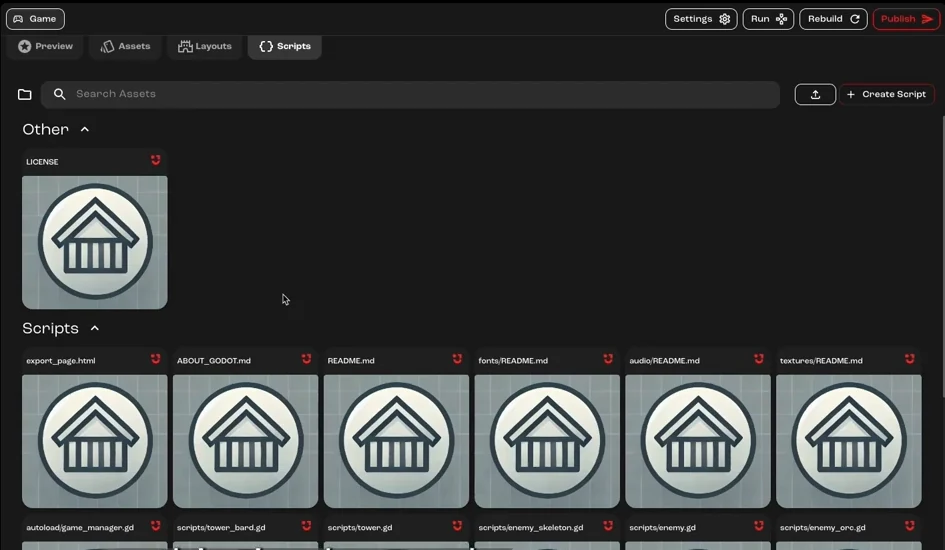
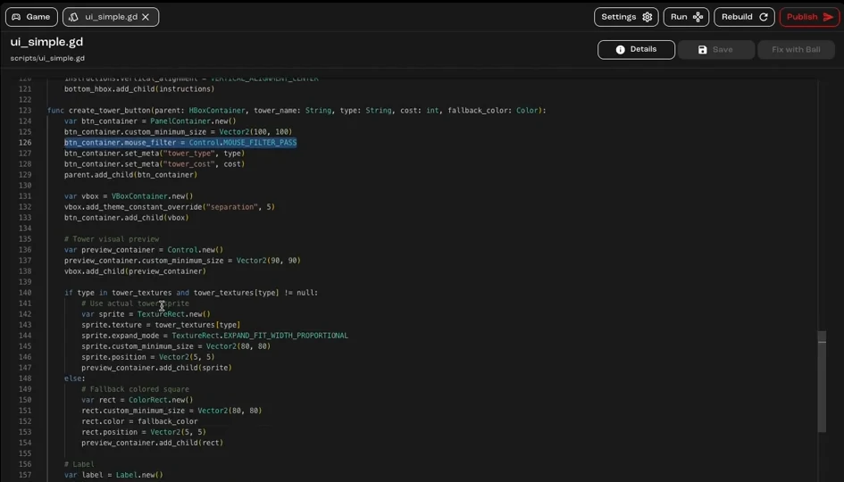
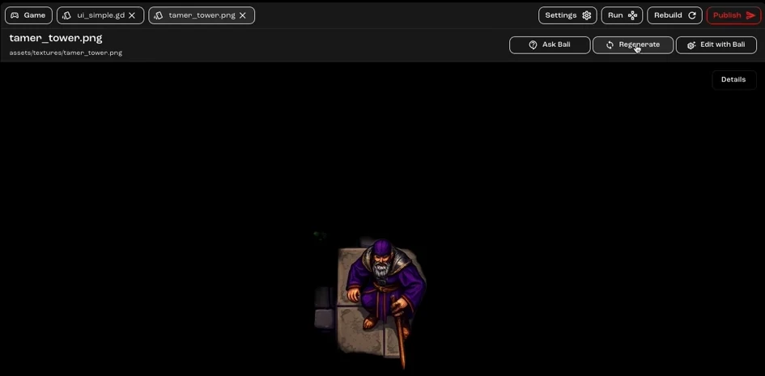
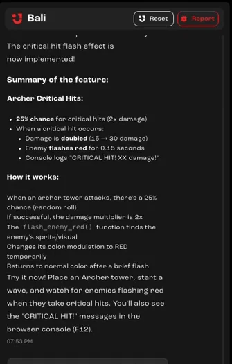
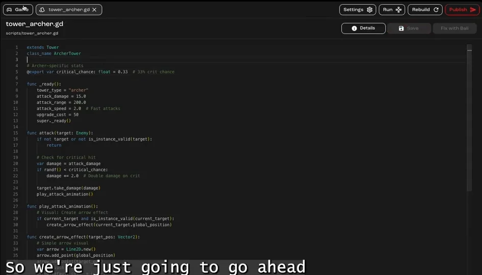

Fix a bug, regenerate a sprite and rebalance a tower defense game, working alongside Bali and editing code by hand where it's quicker.

**You'll learn how to:** find your way around the Assets, Layouts and Scripts tabs, fix a script yourself, rebuild to test, and change a game value directly.

:::note[Recorded on an earlier version]
The screenshots and videos come from an earlier version of Jabali Studio, so some screens look different today. **Current app** notes explain what changed.
:::

## Part 1: Fix dragging and regenerate an asset

<details>
<summary>Prefer to watch? Play the part 1 video (8 min)</summary>

<div class="video-embed"><iframe src="https://www.youtube-nocookie.com/embed/MJI6NWLSwf4" title="Video: Fix and tune a Godot game, part 1" loading="lazy" allow="accelerometer; clipboard-write; encrypted-media; gyroscope; picture-in-picture; web-share" referrerpolicy="strict-origin-when-cross-origin" allowfullscreen></iframe></div>

</details>

### Step 1: Playtest and spot the bug

Play the game in the **Preview** tab. In this tower defense game, you drag towers from the **Towers** panel onto the green squares. The bug: you can only drag a tower by its label, not by the whole panel.

Start a wave to see how the towers behave. Each type trades range against damage: some reach further but hit softer, others hit harder up close.



[Watch this step (00:08)](https://youtu.be/MJI6NWLSwf4?t=8)

### Step 2: Look through the Assets tab

The **Assets** tab holds every asset generated for the game, such as sounds, tower sprites and enemies. Here, the Tamer tower's sprite is too small to see, so it needs regenerating. You'll do that in step 7.



[Watch this step (00:55)](https://youtu.be/MJI6NWLSwf4?t=55)

### Step 3: Check the scenes in the Layouts tab

The **Layouts** tab lists the game's scenes. Look through them to get a general idea of what each one does. If you're not sure, ask Bali to summarize a scene. It can also point out problems and suggest changes.



[Watch this step (01:13)](https://youtu.be/MJI6NWLSwf4?t=73)

:::note[Current app]
You can now edit scenes in the **Layouts** tab. See [Studio interface](/docs/studio/interface/#layouts).
:::

### Step 4: Find the script in the Scripts tab

Open the **Scripts** tab and search for the script you need. Bali names files clearly, so searching for `ui` finds the interface script that handles dragging.



[Watch this step (02:01)](https://youtu.be/MJI6NWLSwf4?t=121)

### Step 5: Fix it

The tower button is a panel with child nodes inside it, such as the preview container and the sprite. The children were catching the mouse before the panel could. The fix is to set each child's `mouse_filter` to `Control.MOUSE_FILTER_IGNORE`, so clicks pass through to the panel.



If you'd rather not edit code, describe the bug to Bali instead.

[Watch this step (02:44)](https://youtu.be/MJI6NWLSwf4?t=164)

### Step 6: Rebuild and test

Go back to the **Preview** tab and click **Rebuild** to run the game with your change. Now you can drag a tower by any part of its panel.

[Watch this step (03:44)](https://youtu.be/MJI6NWLSwf4?t=224)

### Step 7: Regenerate the small sprite

Click the sprite in the **Assets** tab, then click **Regenerate**. Add the size you want to the prompt so the new version comes out bigger.



[Watch this step (04:14)](https://youtu.be/MJI6NWLSwf4?t=254)

### Step 8: Check the result

Go back to the **Preview** tab. The Tamer tower is now big enough to see.

[Watch this step (07:03)](https://youtu.be/MJI6NWLSwf4?t=423)

### Step 9: Know when to edit by hand

Use the **Assets** tab to change assets, and the **Scripts** tab for small, clear code changes like the fix above. Only edit scene files directly for something simple, such as a label's text. For anything bigger, ask Bali.

[Watch this step (07:13)](https://youtu.be/MJI6NWLSwf4?t=433)

## Part 2: Rebalance a tower

<details>
<summary>Prefer to watch? Play the part 2 video (5 min)</summary>

<div class="video-embed"><iframe src="https://www.youtube-nocookie.com/embed/VUhvTpTSTcc" title="Video: Fix and tune a Godot game, part 2" loading="lazy" allow="accelerometer; clipboard-write; encrypted-media; gyroscope; picture-in-picture; web-share" referrerpolicy="strict-origin-when-cross-origin" allowfullscreen></iframe></div>

</details>

### Step 1: Make a hidden mechanic visible

Archers are supposed to land critical hits, but there's no way to tell when they do. Ask Bali to show it, for example:

```text wrap
Make enemies flash red when an archer lands a critical hit.
```

Bali adds the effect and explains how critical hits work in the game.



[Watch this step (00:00)](https://youtu.be/VUhvTpTSTcc?t=0)

### Step 2: Playtest to see it

Build some archer towers and start a wave. When an archer lands a critical hit, the enemy flashes red.

[Watch this step (02:41)](https://youtu.be/VUhvTpTSTcc?t=161)

### Step 3: Rebalance by editing a value

With their short range and low damage, archers need critical hits more often. Open the **Scripts** tab and find the archer's script, `tower_archer.gd`. Change `critical_chance` from `0.15` (15%) to `0.33`, so roughly one hit in three is critical.



[Watch this step (03:02)](https://youtu.be/VUhvTpTSTcc?t=182)

### Step 4: Save, rebuild and test

Click **Save**, go back to the **Preview** tab and click **Rebuild**. Build some archer towers and check that critical hits now happen often enough.

[Watch this step (03:43)](https://youtu.be/VUhvTpTSTcc?t=223)

## Related pages

- [Studio interface](/docs/studio/interface/)
- [Bali best practices](/docs/studio/bali-best-practices/)
