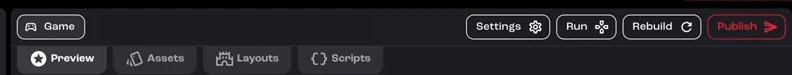
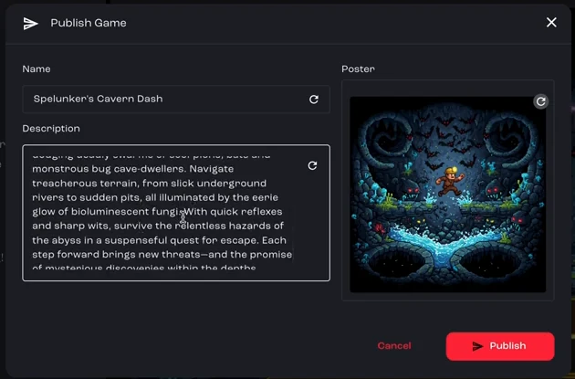
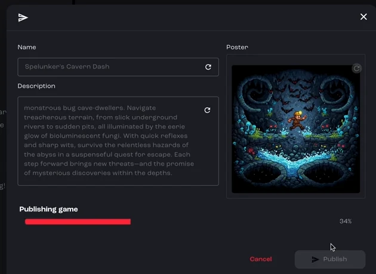
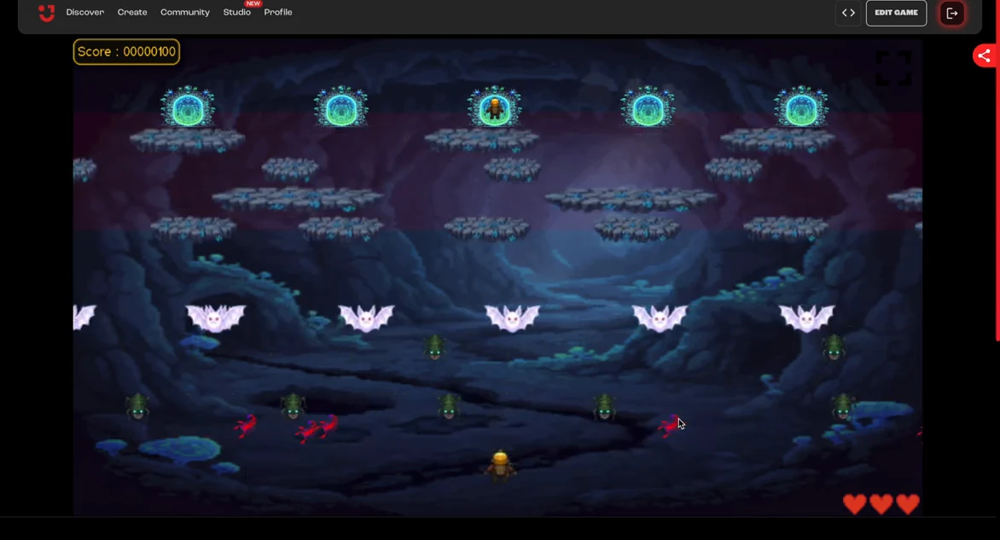

When you've playtested your game and you're happy with the mechanics, logic and assets, publish it so anyone with the link can play it.

:::note[Recorded on an earlier version]
The screenshots and video come from an earlier version of Jabali Studio, so some screens look different today. **Current app** notes explain what changed.
:::

Prefer to watch? Play the full video (2 min)

<iframe src="https://www.youtube-nocookie.com/embed/eyTLACis1z4" title="Video: Publish your game" loading="lazy" allow="accelerometer; clipboard-write; encrypted-media; gyroscope; picture-in-picture; web-share" referrerpolicy="strict-origin-when-cross-origin" allowfullscreen></iframe>

## Step 1: Click Publish

Click **Publish** in the top-right corner of Studio.

[Watch this step (00:00)](https://youtu.be/eyTLACis1z4?t=0)

## Step 2: Review the details

The **Publish Game** dialog shows a summary of what players will see: the game's name, a short description and the poster that represents your game. Bali fills these in for you. Edit anything you want to change, then click **Publish**.

[Watch this step (00:16)](https://youtu.be/eyTLACis1z4?t=16)

:::note[Current app]
The dialog also asks for a **Version** (such as `1.0.1`) and optional **Release Notes**, and each field has a button to have Bali suggest a new value. See [Publish your game](/docs/studio/publish/).
:::

## Step 3: Wait while Studio builds your game

A progress bar shows how far along publishing is. Studio builds the game and gives you a shareable link to the playable version, ready to send to friends, family or your community.

[Watch this step (00:29)](https://youtu.be/eyTLACis1z4?t=29)

:::note[Current app]
When publishing finishes, click **Copy link** to share the game, or **Open in browser** to play it.
:::

## Step 4: Play it the way your players will

Open the link to play the game in your browser, exactly as your players will.

[Watch this step (01:39)](https://youtu.be/eyTLACis1z4?t=99)

That's it: you've gone from an idea to a published, playable game. To change it later, edit it in Studio and publish again.

## Related pages

- [Publish your game](/docs/studio/publish/)
- [Version history](/docs/studio/version-history/)
