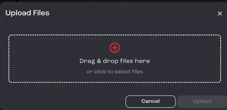
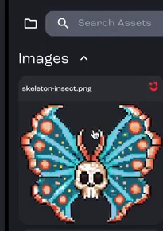
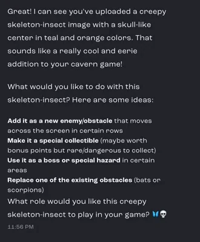
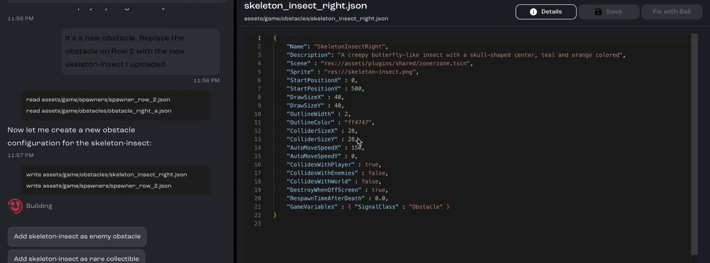

Already have artwork, or want to drop your own monster art straight into a game? Upload it, tell Bali what it's for, and Bali adds it to the game. No coding required.

**Cave arcade game, part 6 of 6.** Each part builds on the one before. See [all tutorials](/docs/tutorials/).

**You'll learn how to:** upload an image, give Bali the context it needs, and check that the new asset works in the game.

:::note[Recorded on an earlier version]
The screenshots and video come from an earlier version of Jabali Studio, so some screens look different today. **Current app** notes explain what changed.
:::

<details>
<summary>Prefer to watch? Play the full video (4 min)</summary>

<div class="video-embed"><iframe src="https://www.youtube-nocookie.com/embed/63RSRln5PuQ" title="Video: Upload your own art" loading="lazy" allow="accelerometer; clipboard-write; encrypted-media; gyroscope; picture-in-picture; web-share" referrerpolicy="strict-origin-when-cross-origin" allowfullscreen></iframe></div>

</details>

## Step 1: Upload your image

Open the **Assets** tab and click the upload button at the top right. Drag your file into the **Upload Files** dialog, or click to select it, then click **Upload**.



The image appears in the Assets tab. The video uploads an illustration of a skeleton insect.



[Watch this step (00:20)](https://youtu.be/63RSRln5PuQ?t=20)

:::note[Current app]
Click **Upload Asset** in the **Assets** tab, or drag files onto the tab. You can upload several files or whole folders at once. See [Upload your own assets](/docs/studio/assets/#upload-your-own-assets).
:::

## Step 2: Describe the image to Bali

Give Bali a short description of the image, such as what it shows and its colors. Bali uses it to write the context and details the game needs to use the image.

[Watch this step (00:38)](https://youtu.be/63RSRln5PuQ?t=38)

## Step 3: Tell Bali what it's for

Bali asks what you'd like to do with the new image and suggests options: a new enemy or obstacle, a special collectible, a boss or special hazard, or a replacement for an existing obstacle.



Answer in plain words. The game had two rows of obstacles using the same green bugs, so the video replaces the ones on row two:

```text wrap
It's a new obstacle. Replace the obstacle on Row 2 with the new skeleton-insect I uploaded.
```

[Watch this step (01:32)](https://youtu.be/63RSRln5PuQ?t=92)

## Step 4: Let Bali add it to the game

Bali creates everything the game needs to treat the image as a real obstacle, not just a file. In this game, that's a new obstacle entry with a name, a description, the sprite, its size, its collision box and its speed, and an update to row two to use it.



[Watch this step (02:39)](https://youtu.be/63RSRln5PuQ?t=159)

## Step 5: Check that it works

Play the game and check that the new art shows up where you asked and behaves correctly. If something's off, describe what you see and let Bali fix it. The video takes a little back and forth to confirm the skeleton insect is referenced, positioned and moving as intended.

[Watch this step (03:26)](https://youtu.be/63RSRln5PuQ?t=206)

## Related pages

- [Upload your own assets](/docs/studio/assets/#upload-your-own-assets)
- [Attachments](/docs/studio/attachments/)
