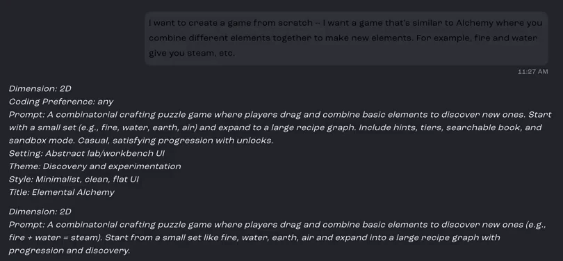
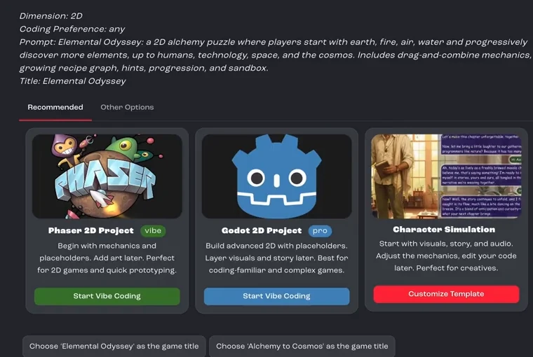
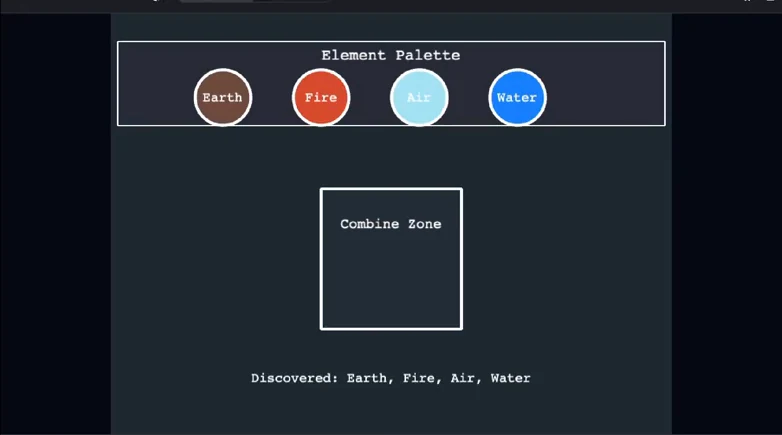
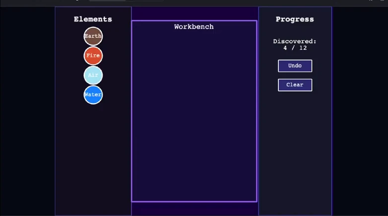
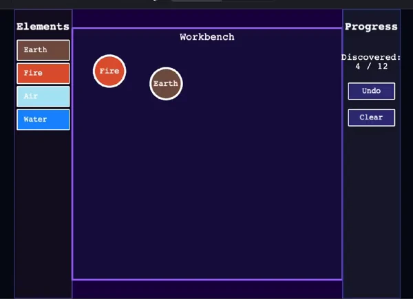
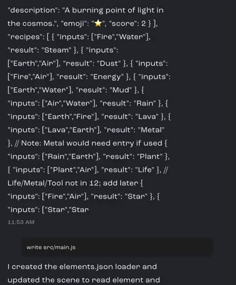
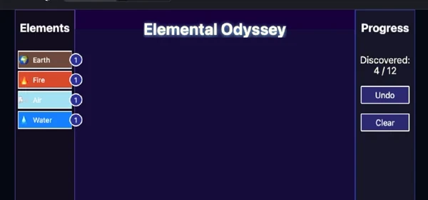
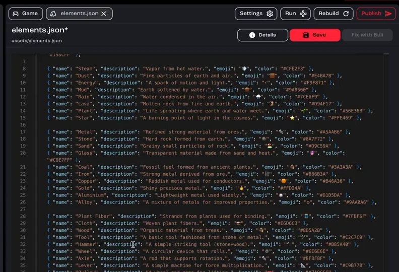
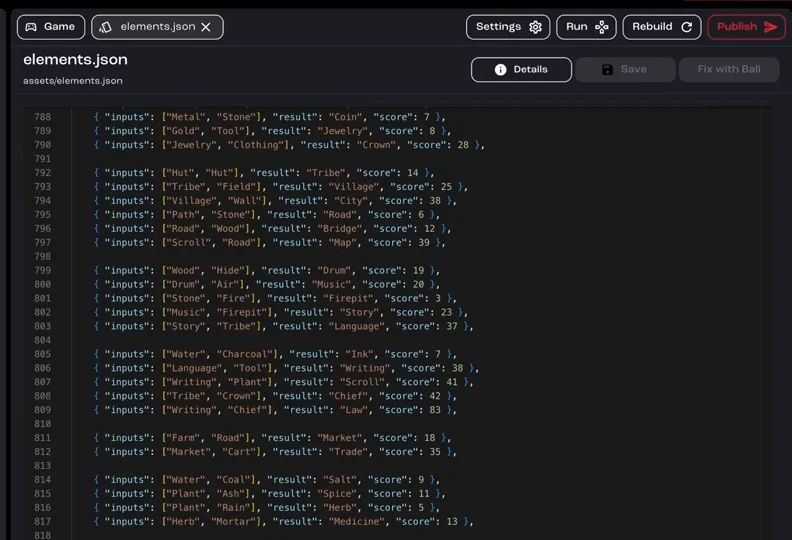

Build an alchemy game, where players combine elements to discover new ones, starting from an idea instead of a template. Part 1 builds a playable prototype. Part 2 scales up the content and adds polish.

**You'll learn how to:** start a web project from an idea, steer Bali when a result isn't what you pictured, and keep game content in a data file so it can grow without touching the code.

:::note[Recorded on an earlier version]
The screenshots and videos come from an earlier version of Jabali Studio, so some screens look different today. **Current app** notes explain what changed.
:::

## Part 1: From idea to prototype

<details>
<summary>Prefer to watch? Play the part 1 video (36 min)</summary>

<div class="video-embed"><iframe src="https://www.youtube-nocookie.com/embed/QUF5JYjUqy4" title="Video: Build a web game from scratch, part 1" loading="lazy" allow="accelerometer; clipboard-write; encrypted-media; gyroscope; picture-in-picture; web-share" referrerpolicy="strict-origin-when-cross-origin" allowfullscreen></iframe></div>

</details>

### Step 1: Start from an idea

Describe the game you have in mind, not a template. The video uses this prompt:

> I want to create a game from scratch – I want a game that's similar to Alchemy where you combine different elements together to make new elements. For example, fire and water give you steam, etc.

Bali turns your idea into a short design summary: 2D or 3D, how much code you want to write, a fuller description of the game, and the setting, theme, style and a working title.



[Watch this step (00:00)](https://youtu.be/QUF5JYjUqy4?t=0)

### Step 2: Pick a title

Ask Bali for options, for example *"I want a 2D game. Give me a few options for titles for this game."* Bali suggests titles that match your concept. Pick the one you like. The video chooses *Elemental Odyssey*.

[Watch this step (00:55)](https://youtu.be/QUF5JYjUqy4?t=55)

### Step 3: Choose the Phaser 2D project

When none of the templates match your idea, start from a blank project instead. Bali offers a **Phaser 2D Project**, which starts with mechanics and placeholders so you can add art later. Click **Start Vibe Coding** on it.



[Watch this step (01:57)](https://youtu.be/QUF5JYjUqy4?t=117)

:::note[Current app]
Under the prompt box, choose **Engine** → **Web** with the Phaser starter. See [Game engines and web projects](/docs/studio/engines/).
:::

### Step 4: Let Studio write the starter code

The editor opens and Studio starts writing the first version of the game: starter code and a basic interface made of simple shapes. It's just enough to be playable, and you'll shape it from here.

[Watch this step (02:17)](https://youtu.be/QUF5JYjUqy4?t=137)

### Step 5: Understand how Bali works on a task

From now on, Studio coordinates the work with you. You describe the next task, Studio turns it into a plan, and it hands each part to the Bali agent best suited to it.

[Watch this step (03:10)](https://youtu.be/QUF5JYjUqy4?t=190)

### Step 6: Ask for a minimal prototype

Ask for the smallest version you can play with, for example *"Design a minimal playable prototype: a simple interface that lets me combine elements."* This gives you something to test while you work out the mechanics.



[Watch this step (03:42)](https://youtu.be/QUF5JYjUqy4?t=222)

### Step 7: Redirect it if it isn't what you pictured

The first layout works, but it isn't what the video's creator had in mind. Say what you want instead. Here, the request is to redesign it with three vertical panels, which better matches how players will use the elements.



[Watch this step (04:50)](https://youtu.be/QUF5JYjUqy4?t=290)

### Step 8: Review code changes

From time to time, Studio asks you to review and accept code changes. You can inspect and edit the code yourself in the **Scripts** tab.

[Watch this step (09:48)](https://youtu.be/QUF5JYjUqy4?t=588)

### Step 9: Keep iterating

Make a few more requests to clean things up, such as spacing, labels and interactions. Iterate as much as you like: this back and forth is how a blank project becomes your game.

[Watch this step (10:09)](https://youtu.be/QUF5JYjUqy4?t=609)

### Step 10: Play it, then change what doesn't feel right

Once the layout looks right, play with it. In the video, dragging elements doesn't feel good, so the next request switches to tapping. It also asks for a scrolling list in the left panel, so players can see and select every element they've discovered.



[Watch this step (12:48)](https://youtu.be/QUF5JYjUqy4?t=768)

### Step 11: Move the game data into a JSON file

To keep the game easy to grow, ask Bali to separate the content from the code:

```text wrap
Move the element definitions, recipes and scores out of the game code into a JSON file that the game loads when it starts.
```

Then you can add elements later by editing data instead of game logic.

[Watch this step (22:41)](https://youtu.be/QUF5JYjUqy4?t=1361)

### Step 12: Check the new data file

Open the **Scripts** tab to find the new `elements.json` file. The ingredients and recipes now live apart from the main code, which makes the project feel like a reusable alchemy template.



[Watch this step (27:53)](https://youtu.be/QUF5JYjUqy4?t=1673)

## Part 2: Balance, lore and progression

<details>
<summary>Prefer to watch? Play the part 2 video (15 min)</summary>

<div class="video-embed"><iframe src="https://www.youtube-nocookie.com/embed/h3zrciNlF-Y" title="Video: Build a web game from scratch, part 2" loading="lazy" allow="accelerometer; clipboard-write; encrypted-media; gyroscope; picture-in-picture; web-share" referrerpolicy="strict-origin-when-cross-origin" allowfullscreen></iframe></div>

</details>

### Step 1: Review the element list

The elements now appear in a list on the left, each with its score next to it. With the core loop visible at a glance, it's much easier to think about balance and progression.

[Watch this step (00:00)](https://youtu.be/h3zrciNlF-Y?t=0)

### Step 2: Fix readability

Look for anything hard to read. In the video, *Air* is white text on a light blue background, so it almost disappears, and the emojis drift outside the list. Ask Bali to fix both:

```text wrap
Improve the contrast so every element name is readable, and align the emojis neatly inside the list.
```




[Watch this step (01:09)](https://youtu.be/h3zrciNlF-Y?t=69)

### Step 3: Grow the content

With a working prototype, it's time to scale up. Because the content lives in a data file, you can grow it without touching the game code:

```text wrap
Expand elements.json from the initial 15 elements to at least 50.
```

[Watch this step (06:03)](https://youtu.be/h3zrciNlF-Y?t=363)

### Step 4: Review the expanded list

Open `elements.json` to see the new elements Bali added, each with a description, an emoji and a color. The small prototype is now a much richer game, just from extending the data.



[Watch this step (07:44)](https://youtu.be/h3zrciNlF-Y?t=464)

### Step 5: Add flavor

Give discoveries some drama. The video adds a godlike narrator who announces every new element with a short line of lore, in the style of a divine announcement. Bali adds a narration line for each element to the JSON file.

[Watch this step (08:38)](https://youtu.be/h3zrciNlF-Y?t=518)

### Step 6: Make scoring fair

Some elements can be made with more than one recipe. Ask Bali to refine the scoring so the game rewards discoveries consistently, however the player makes them.



[Watch this step (11:49)](https://youtu.be/h3zrciNlF-Y?t=709)

### Step 7: Test, then publish

Test the logic one more time. You now have a fully playable alchemy game built without a template. When you're happy, [publish](/docs/tutorials/publish-a-game/) it.

[Watch this step (14:16)](https://youtu.be/h3zrciNlF-Y?t=856)

## Related pages

- [Game engines and web projects](/docs/studio/engines/)
- [Bali best practices](/docs/studio/bali-best-practices/)
- [Studio interface](/docs/studio/interface/)
