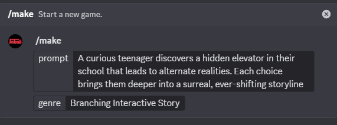
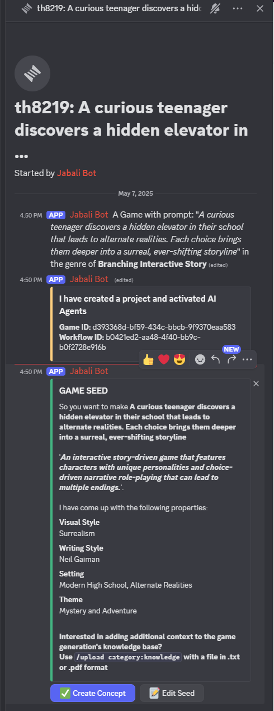
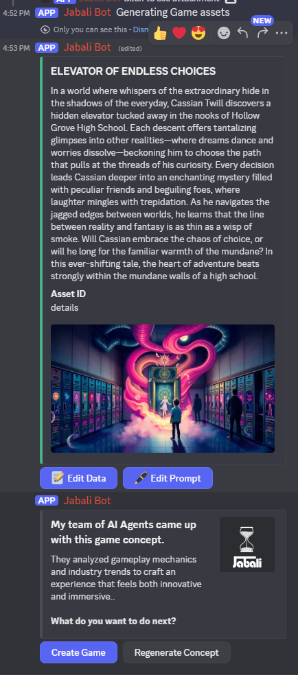
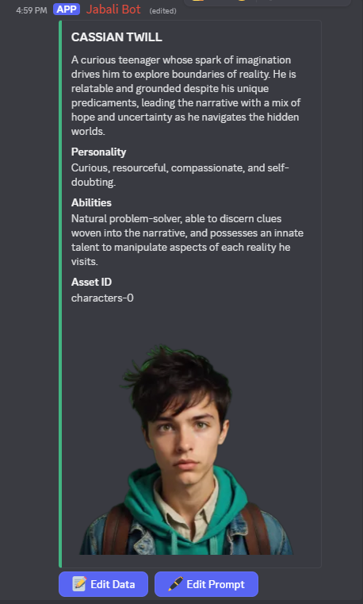
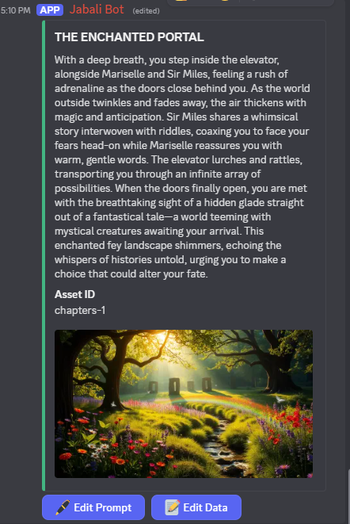

# 📖 Tutorial: Build a Branching Interactive Story Game with Jabali (Discord)

In this tutorial, you'll learn how to use the Jabali Discord Bot to create a branching narrative game — where the player's choices shape the outcome of the story.

Jabali makes it easy to go from a simple idea to a fully interactive, AI-generated game — all using natural language prompts.

---

## 🚀 Step 1: Start Your Game with a Prompt

Go to a channel where the Jabali bot is active and type:

***/make***

Then, when prompted, enter a descriptive prompt like:

_A curious teenager discovers a hidden elevator in their school that leads to alternate realities. Each choice brings them deeper into a surreal, ever-shifting storyline._

Then select genre ***Branching Interactive Story***

Jabali will create a thread in Discord.
Jabali will analyze this prompt and create your game seed.

## 🌱 Step 2: Review and Edit the Game Seed
The game seed includes core parameters like:

Visual Style (e.g., hand-drawn, pixel art)

Theme (e.g., mystery, coming of age)
You can edit the seed at any time in Discord 

Click on **'Create Concept'** to continue

## 🎮 Step 3: Accept or Regenerate the Game Concept
Jabali will then generate a Game Concept, which includes:

🎮 A Game Title

📖 A Story Summary

🎨 An AI-generated Poster

If you like it, hit **Create Game**.

## 🧍 Step 4: Define Your Player and Characters
Use character prompts to define the player and key NPCs:

## Step 5 : Edit Scenes 
Next up, different locations where the story unfolds will be generated. You can edit the prompt to regeenrate the images of these locations. 

