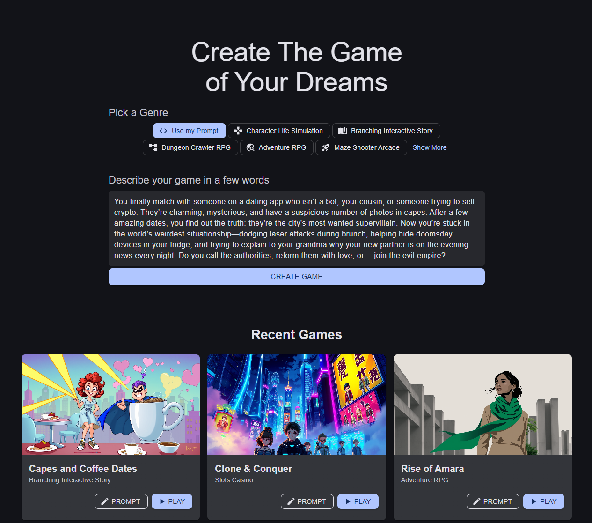

# 🌐 Game Generation on the Web

Jabali’s web app gives you the power of AI-driven game creation with a visual experience. Everything you can do in Discord, you can also do on the web — with the added bonus of real-time editing, asset previews, and easy content organization.

---
## 🚀 Getting Started
To begin generating games in your browser:

1. Visit [https://build.production.jabali.ai](https://build.production.jabali.ai)  
2. Log in using your Google or Discord account  
3. Enter a Prompt and Choose a template (Character Sim, Interactive Story, Arcade, etc.) or start from scratch.
4. Finally click **"Create Game"** to begin your first project

## ✨ What You Can Generate
Just like on Discord, you can generate:

- **🎮 Core Game Details:** Visual style, writing style, setting, theme  
- **🗺️ Level Structure:** Level names, environment descriptions, and story arcs  
- **🧍 Characters:** Names, personalities, abilities, and visual portraits  
- **🎨 Assets:** Backgrounds, objects, sprites, music, and sound effects

## 🧠 Prompting Game Content

Each major element of your game — scenes, characters, items — begins with a **prompt**. Jabali will generate game-ready content using your description.

**Example Prompt (Character):**

> A sleepy raccoon innkeeper who used to be a legendary thief.  
> Outfit: Wears a patched vest and monocle, and always carries a cup of tea.

**Example Prompt (Scene):**

> A wind-swept mountaintop temple at sunset, with broken columns and ringing bells.

You can also edit or regenerate results in one click. For tips, see the [Prompting Guide](asset-prompt-tips.md).

---

## 🧰 Editing Game Content

The web editor lets you directly edit content generated by Jabali. This includes:

| Element            | Editable Fields                                                    |
|--------------------|---------------------------------------------------------------------|
| **Game Settings**   | Visual Style, Writing Style, Theme, Setting                        |
| **Levels**          | Name, Description, Story Synopsis                                  |
| **Characters**      | Name, Description, Personality, Abilities                          |
| **Assets**          | Image and Sound Previews, Prompt Descriptions, Tags                |

To edit, simply click on any content block and revise it inline. Changes are auto-saved and immediately reflected in the game preview.

---

## 📁 Uploading Custom Content

Uploading custom content is currently **not supported** on the Web and will be added soon.

---

## ▶️ Publishing & Playtesting

Once generation is complete, Click the **▶️ Play** button at any time to launch an interactive preview of your game. You can:

- Test character interactions and branching choices  
- Review scene transitions and story progression  
- Simulate gameplay mechanics for arcade-style games  

Playtest early, playtest often — it's the fastest way to refine your game.

---
Jabali’s web app gives you the tools to build, play, and polish your game — all in one place. ✨  
Start creating today at [https://build.production.jabali.ai](https://build.production.jabali.ai)