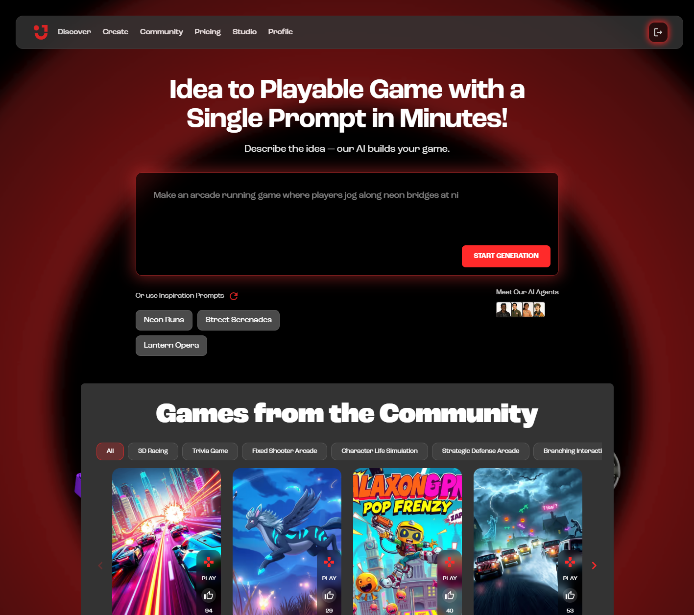
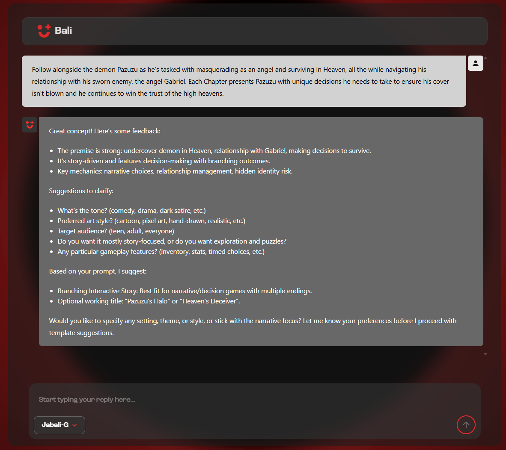
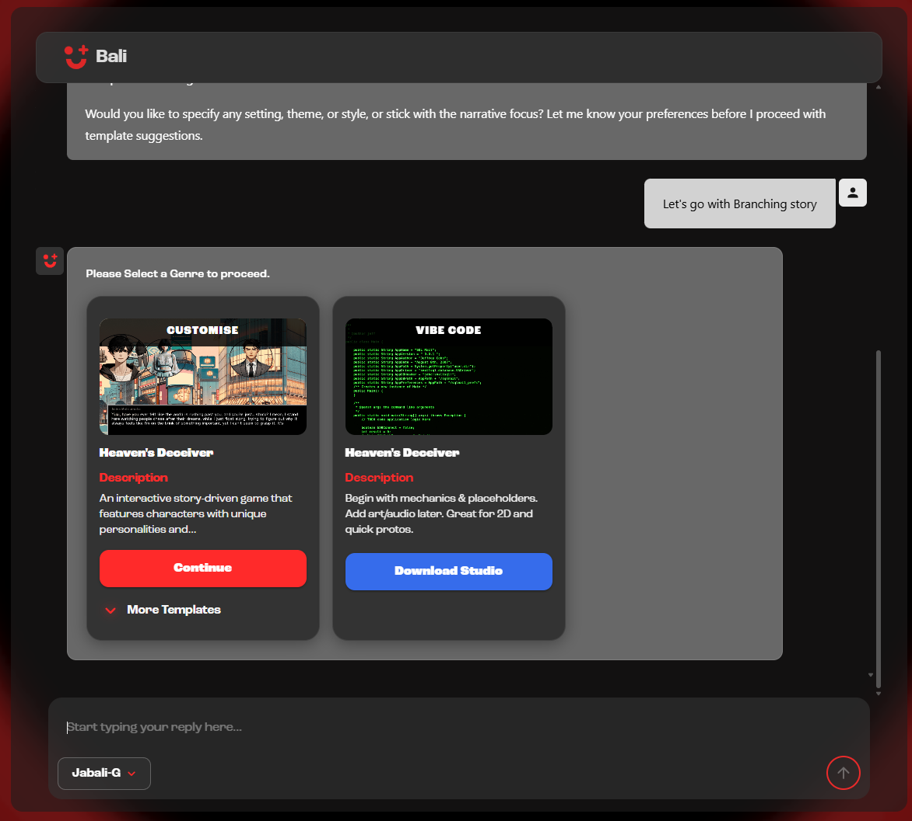
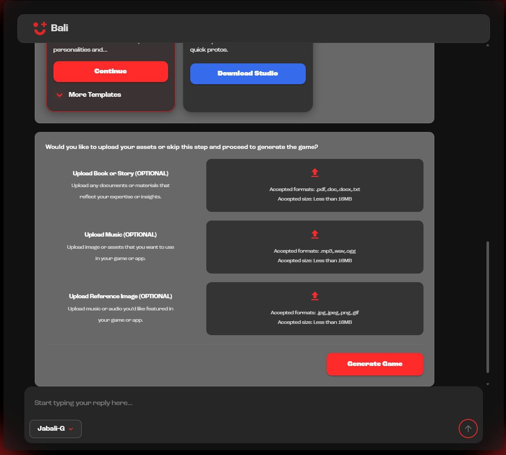
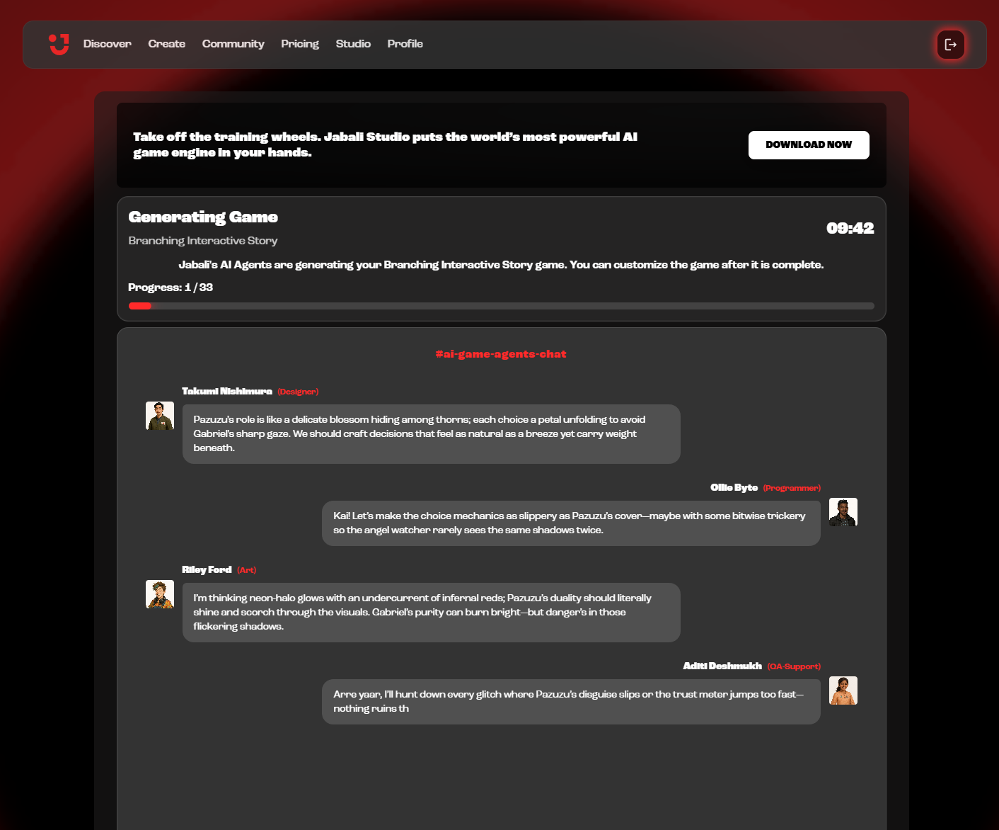
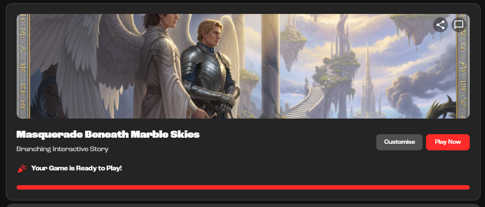
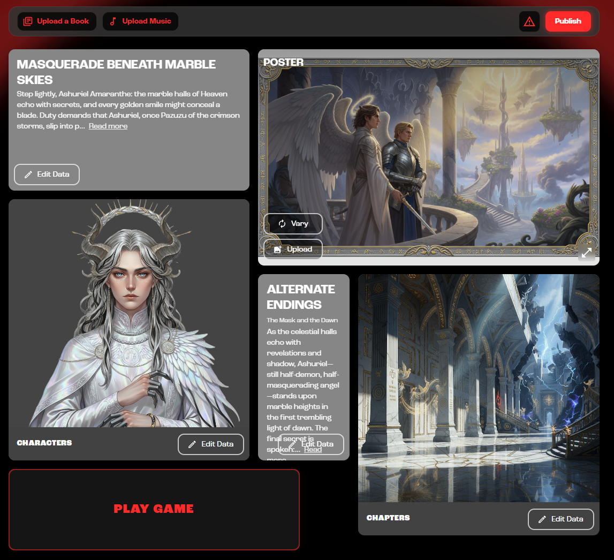

# 🌐 Game Generation on the Web

Jabali’s web app gives you the power of AI-driven game creation with a visual experience. Everything you can do in Discord, you can also do on the web — with the added bonus of real-time editing, asset previews, and easy content organization.

---
## 🚀 Getting Started
To begin generating games in your browser:

1. Visit [https://.jabali.ai](https://jabali.ai)  
2. Log in using your Google or Discord account  
3. Enter a Prompt or choose one from the list provided as inspiration.
4. Finally click **"Start Generation"** to begin your first game

## ✨ Engage with Bali, Jabali's AI Assistant 
Bali is your AI-game assistant and will walk you through the process of identifying the best way to generate your game. Bali can dispatch agents that can generate the following:

- **🎮 Core Game Details:** Visual style, writing style, setting, theme  
- **🗺️ Level Structure:** Level names, environment descriptions, and story arcs  
- **🧍 Characters:** Names, personalities, abilities, and visual portraits  
- **🎨 Assets:** Backgrounds, objects, sprites, music, and sound effects

But before you do that, you will need to pick a genre for your prompt. As you chat with Bali, it will automatically make genre recommendations. Selecting a genre is final so once you make a choice it cannot be undone. So choose wisely! 

## 📁 Uploading Custom Content

Jabali lets you upload your own content to enhance game generation — whether it’s a **knowledge file** that enriches the AI’s storytelling, or **branded assets** like custom images and sounds for your game. 

After you slect a genre, you will be presented with the option to upload your content.

### 🔍 Supported Upload Types

| Type               | Description                                                   |
|--------------------|---------------------------------------------------------------|
| **Knowledge File** | Text documents used as a knowledge base for AI generation     |
| **Branded Asset**  | Custom images or sound files tied to specific in-game assets  |

### 📁 Supported File Types
- Docs: `.pdf`, `.txt`, `.doc` or `.docx` 
- Audio: `.mp3` or `.wav` 
- Music: `.png`, `.jpg`, `.jpeg`, `.gif`

### 📏 Limits
- Max file size: **5MB**
- Max content length: **1000 lines**

## Game Generation
Once you have finalized the genre, Jabali Agents will automatically generate your game based on your prompt.

Wait for the agents to finish generation and then you can play the game

---

## 🧰 Customizing Game Content

On Jabali web you can also choose to customize individual game components by clicking on **Customize**. This will open the game customization window which allows you to change the following:

| Element            | Editable Fields                                                    |
|--------------------|---------------------------------------------------------------------|
| **Game Settings**   | Visual Style, Writing Style, Theme, Setting                        |
| **Levels**          | Name, Description, Story Synopsis                                  |
| **Characters**      | Name, Description, Personality                          |
| **Assets**          | Image Previews, Prompts                |

To edit, simply click on any content block and revise it inline. Save your changes and **Publish** your game.

Playtest early, playtest often — it's the fastest way to refine your game.

---
Jabali’s web app gives you the tools to build, play, and polish your game — all in one place. ✨  
Start creating today at [https://jabali.ai](https://jabali.ai)